# LTI — Documento de Arquitectura del Sistema

> **Versión**: 2.0 (MVP — production-grade design)
> **Autor**: Equipo de Producto & Arquitectura
> **Fecha**: 2026-05
> **Estado**: Diseño aprobado para construcción
> **Audiencia**: Equipo de ingeniería, producto, diseño y stakeholders ejecutivos

---

## Índice

1. [Descripción del producto](#1-descripción-del-producto)
2. [Lean Canvas](#2-lean-canvas)
3. [Casos de uso principales](#3-casos-de-uso-principales)
4. [Customer Journey del candidato](#4-customer-journey-del-candidato)
5. [Modelo de datos (DER)](#5-modelo-de-datos-der)
6. [Diseño del sistema a alto nivel](#6-diseño-del-sistema-a-alto-nivel)
7. [Arquitectura C4](#7-arquitectura-c4)
8. [Diagramas de infraestructura y despliegue](#8-diagramas-de-infraestructura-y-despliegue)
9. [Diagramas de flujo y secuencia](#9-diagramas-de-flujo-y-secuencia)
10. [Seguridad y compliance](#10-seguridad-y-compliance)
11. [Atributos de calidad y SLAs](#11-atributos-de-calidad-y-slas)
12. [Estrategia de reportes y analytics](#12-estrategia-de-reportes-y-analytics)
13. [Estrategia de testing](#13-estrategia-de-testing)
14. [Glosario](#14-glosario)

---

## 1. Descripción del producto

### 1.1 Qué es LTI

**LTI** es un sistema SaaS de Applicant Tracking System (ATS) + CRM de talento + Onboarding light, diseñado específicamente para **PyMEs argentinas de 10 a 200 empleados** que necesitan profesionalizar su proceso de reclutamiento sin pagar las licencias prohibitivas de las suites enterprise (Workday, SAP SuccessFactors, Greenhouse).

LTI cubre el ciclo completo: desde la solicitud y aprobación de una vacante, pasando por sourcing, screening, entrevistas, oferta y firma, hasta el onboarding del primer día del nuevo empleado.

### 1.2 Propuesta de valor

> **"Cubrí tus vacantes en la mitad del tiempo. Que la IA y las automatizaciones hagan el trabajo administrativo, y tu equipo se concentre en hablar con el mejor talento."**

### 1.3 Valor añadido y ventajas competitivas

| Eje | Cómo lo logra LTI | Por qué la competencia no lo hace bien |
|---|---|---|
| **Eficiencia HR (best-in-class)** | Automatizaciones nativas que eliminan 60-70% del trabajo administrativo del reclutador (scheduling, recordatorios, screening inicial, nurturing del pool). | Las suites enterprise tienen las features pero requieren consultoras y meses de implementación; los low-cost no las tienen. |
| **Automatizaciones de proceso** | Matching IA con embeddings, auto-scheduling con Google Calendar, generación de descripciones de vacante, summarization de entrevistas, nurturing automático del talent pool. | Productos como Trello o spreadsheets no lo tienen; productos como Bizneo o Talently lo tienen parcial y mal integrado. |
| **Foco en SMB Argentina** | Compliance Ley 25.326, idioma español, soporte en horario AR, integración con LinkedIn (job board #1 en AR para perfiles profesionales) y Google Workspace (stack más usado en SMB AR). | Greenhouse/Lever no piensan en AR; los locales (Bizneo, Nawaiam) no tienen el nivel de IA que tiene LTI. |
| **Pricing transparente y accesible** | USD 49/usuario/mes, sin costos de implementación, trial 14 días sin tarjeta. | Greenhouse arranca en USD 6.500/año por slot mínimo; los locales tienen pricing opaco y por demo obligatoria. |
| **Time-to-value <1 semana** | Onboarding self-service, plantillas pre-configuradas para roles típicos AR (Dev, Comercial, Admin, Operaciones), sin necesidad de consultor. | Las soluciones enterprise requieren 3-6 meses de implementación. |

### 1.4 Funciones principales

#### Núcleo ATS
- **Gestión de vacantes**: creación con plantillas, workflow de aprobación interno, salary band, hiring manager asignado.
- **Pipeline de reclutamiento**: pipeline estándar configurable en nombres/orden de etapas, drag & drop tipo Kanban.
- **Base de candidatos**: parsing automático de CV, deduplicación, búsqueda booleana + semántica (embeddings).
- **Portal del candidato**: aplicación con autocompletado desde CV, tracking del estado en tiempo real.
- **Careers site**: página pública por tenant con su branding (subdominio `<tenant>.lti.app`).
- **Scorecards estándar** con campos opcionales por vacante.
- **Gestión de ofertas** con envío vía DocuSign para firma electrónica.

#### CRM de talento
- **Talent Pool**: candidatos rechazados o pasivos quedan en el pool segmentables por tags, skills, seniority.
- **Sourcing manual**: importación de candidatos al pool sin que apliquen a una vacante.
- **Campañas de email** a segmentos del pool.
- **Nurturing automático**: cuando se publica una vacante nueva, LTI sugiere candidatos del pool con match alto.

#### Onboarding light
- **Checklist pre-primer-día**: tareas a completar por el nuevo empleado (firma de docs, datos bancarios, foto, equipamiento).
- **Welcome kit digital** con info de la empresa, organigrama, FAQs.
- **Firma de documentos** vía DocuSign.

#### Inteligencia Artificial (AWS Bedrock)
- **Matching candidato↔vacante** vía embeddings + similitud coseno.
- **Generación de descripciones de vacante** desde un prompt corto del reclutador.
- **Summarization de entrevistas** desde transcript subido por el reclutador.

#### Automatizaciones
- Auto-scheduling con Google Calendar (candidato elige slot disponible del entrevistador).
- Recordatorios automáticos (a candidato pre-entrevista, a entrevistador para completar scorecard).
- Nurturing automático del talent pool al publicar vacantes.
- Notificaciones in-app y por email en cada cambio de estado relevante.

#### Reportería
Dashboards must-have del MVP (cálculo y arquitectura detallados en sección 12):
- Embudo por vacante (etapa por etapa con conversion rates).
- Time-to-hire promedio (global, por reclutador, por tipo de rol).
- Source effectiveness (LinkedIn vs Careers Site vs Referidos).
- Carga de trabajo por reclutador.
- Vacantes en riesgo (>30 días abiertas sin avance).

---

## 2. Lean Canvas

> **Nota técnica**: Mermaid no tiene un tipo de diagrama nativo para Lean Canvas. Se representa como tabla Markdown estructurada — formato estándar usado en documentación de producto en herramientas tipo Notion/Confluence. Para una versión visual con los 9 cuadrantes coloreados al estilo Ash Maurya, importar este contenido a Canvanizer (https://canvanizer.com) o Miro y exportar como imagen.

| **PROBLEMA** | **SOLUCIÓN** | **PROPUESTA DE VALOR ÚNICA** | **VENTAJA INJUSTA** | **SEGMENTOS DE CLIENTES** |
|---|---|---|---|---|
| **Top 3 problemas:**  • Reclutadores en SMB pierden 60-70% del tiempo en tareas administrativas (agendar entrevistas, enviar mails, copiar CVs a Excel) en lugar de hablar con candidatos.  • Las vacantes tardan 45-60 días en cubrirse, lo que cuesta productividad al negocio y desgasta al equipo.  • Los hiring managers no tienen visibilidad del proceso y son el cuello de botella; el feedback de entrevistas se pierde en mails.  **Alternativas existentes:** • Excel + Gmail • LinkedIn Recruiter solo • Greenhouse/Lever (caros, pensados para US) • Bizneo, Talently (locales, sin IA real) | **Top 3 features:**  • Pipeline Kanban + IA de matching que rankea candidatos automáticamente al aplicar.  • Auto-scheduling con Google Calendar (candidato elige slot, sin ida y vuelta de mails).  • Generación IA de descripciones de vacante y summarization de entrevistas.  • Workflow de aprobaciones, scorecards y onboarding light integrados.  • Talent pool con nurturing automático cuando hay vacantes nuevas. | **"Cubrí tus vacantes en la mitad del tiempo. Que la IA haga el trabajo administrativo, vos enfocate en el talento."**  **Concepto de alto nivel:** "Es el Greenhouse de las PyMEs argentinas, con IA nativa y a 1/10 del precio." | • Foco vertical y geográfico: PyMEs argentinas. Construido específicamente para el mercado AR (idioma, compliance Ley 25.326, integraciones locales).  • Stack de IA propio (matching, generación, summarization) usando embeddings de Bedrock — competidores locales no lo tienen, competidores globales no lo tunean a CV en español rioplatense.  • Time-to-value <1 semana: self-service onboarding sin consultoras. | **Early adopters:** • Startups tech argentinas de 30-100 empleados con equipos de talent acquisition de 1-3 personas.  • PyMEs de servicios profesionales (consultoras, agencias) que contratan 20-50 personas/año.  **Mercado total:** • ~15.000 PyMEs en Argentina con 10-200 empleados. • Expansible a Uruguay, Chile, Colombia, México (Fase 2). |
| **MÉTRICAS CLAVE** | | | **CANALES** | |
| • **Activación**: % de tenants que crean su 1ra vacante en 7 días. • **Engagement**: vacantes activas por tenant/mes. • **Eficiencia**: time-to-hire promedio del cliente vs benchmark del sector. • **Adopción IA**: % de vacantes creadas con asistente IA. • **NPS**: medido trimestralmente. • **Churn mensual**: <3% mensual objetivo. • **MRR / ARR**: meta Año 1: USD 200K ARR. | | | • **Inbound digital**: SEO/Content marketing (blog sobre reclutamiento PyME AR), LinkedIn organic, Google Ads. • **Product-led growth**: trial 14 días sin tarjeta, viralidad por candidatos que ven la marca LTI en aplicación. • **Partnerships**: con cámaras (CAC, CESSI), comunidades tech (FlexJobs LATAM, OpenQube), consultoras de RRHH. • **Outbound**: BDR a Heads of HR de PyMEs target. • **Eventos**: sponsorship de eventos de RRHH (Congreso ADRHA). | |
| **ESTRUCTURA DE COSTOS** | | | **FUENTES DE INGRESO** | |
| **Costos fijos:** • Infra AWS (~USD 2K-5K/mes en MVP, escala con tenants). • Equipo: 4 ingenieros, 1 PM, 1 diseñador, 1 CSM, 1 marketing. • Costos AWS Bedrock por inferencia (variable, ~USD 0,50/vacante creada con IA). • DocuSign: USD 25/usuario/mes (negociable a volumen).  **Costos variables:** • Adquisición (CAC objetivo <USD 600). • Soporte (~5% del MRR). • AWS SES, S3, transferencia.  **Unit economics objetivo:** • ARPU: USD 245/mes (5 users x USD 49). • Margen bruto: 75%+. | | | • **Suscripción SaaS**: USD 49/usuario/mes, facturación mensual o anual (15% off anual). • Tier único en MVP (todos los features incluidos para mantener la propuesta simple). | |

---

## 3. Casos de uso principales

Los 3 casos de uso elegidos son los que mejor representan el valor diferencial de LTI (eficiencia + automatizaciones) y cubren los flujos más críticos del producto.

> **Nota sobre notación**: Mermaid no soporta nativamente la notación UML estándar de Use Case Diagrams (elipses + actores stick). Usamos `flowchart` adaptado: actores como nodos redondeados con emoji, casos de uso como elipses (`(["..."])`) y relaciones `<<include>>` / `<<trigger>>` como líneas punteadas. El intent UML se mantiene; cambia solo la representación visual.

### 3.1 Caso de uso 1 — Publicación de vacante con asistente IA y matching automático

**Actores**: Hiring Manager, Recruiter, Sistema IA, Candidato.

**Precondiciones**: tenant activo, hiring manager y recruiter con cuentas, talent pool con candidatos previos.

**Flujo principal**:
1. Hiring Manager solicita vacante mediante un form corto (rol, seniority, skills core, salary band).
2. Recruiter recibe la solicitud y la abre. Hace click en **"Generar descripción con IA"** y LTI produce un draft completo.
3. Recruiter ajusta texto y publica la vacante en el careers site del tenant.
4. **Automáticamente**, LTI corre matching contra el talent pool y le sugiere al recruiter los top 10 candidatos pasivos.
5. Recruiter invita a esos candidatos a aplicar (1 click).
6. Candidatos nuevos aplican vía careers site → CV se parsea, embeddings se calculan, se rankea contra la vacante.
7. Recruiter ve el pipeline ya con candidatos rankeados por match score.

**Postcondiciones**: vacante publicada, candidatos del pool nurturizados, pipeline poblado con ranking IA.

**Diagrama de caso de uso**:

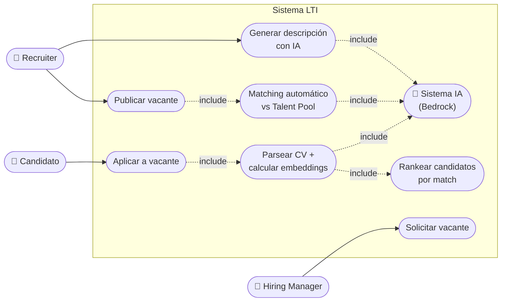
```mermaid
flowchart LR
    HM(["👤 Hiring Manager"])
    RC(["👤 Recruiter"])
    CA(["👤 Candidato"])
    AI(["🤖 Sistema IA<br/>(Bedrock)"])

    subgraph LTI["Sistema LTI"]
        UC1(["Solicitar vacante"])
        UC2(["Generar descripción<br/>con IA"])
        UC3(["Publicar vacante"])
        UC4(["Matching automático<br/>vs Talent Pool"])
        UC5(["Aplicar a vacante"])
        UC6(["Parsear CV +<br/>calcular embeddings"])
        UC7(["Rankear candidatos<br/>por match"])

        UC2 -.->|include| AI
        UC3 -.->|include| UC4
        UC4 -.->|include| AI
        UC5 -.->|include| UC6
        UC6 -.->|include| AI
        UC6 -.->|include| UC7
    end

    HM --> UC1
    RC --> UC2
    RC --> UC3
    CA --> UC5
```

---

### 3.2 Caso de uso 2 — Auto-scheduling de entrevista con Google Calendar

**Actores**: Recruiter, Candidato, Interviewer (Hiring Manager u otro), Google Calendar.

**Precondiciones**: candidato en pipeline, interviewer con cuenta de Google Calendar conectada a LTI vía OAuth.

**Flujo principal**:
1. Recruiter mueve candidato a la etapa "Entrevista técnica".
2. LTI detecta el cambio y dispara automatización: pide al interviewer que confirme su disponibilidad (LTI ya conoce su calendario por OAuth).
3. LTI calcula los slots libres del interviewer en los próximos 5 días hábiles, dentro de su horario laboral.
4. LTI envía email al candidato con un link único para que elija slot (sin login).
5. Candidato elige slot → LTI crea evento en Google Calendar del interviewer y del candidato (este último vía invite), genera link de Meet automáticamente.
6. LTI envía confirmación a ambos + recordatorio 24hs antes y 1hr antes.
7. Después de la entrevista, LTI envía al interviewer un email + notificación in-app pidiendo el scorecard. Si no lo completa en 24hs, recordatorio automático.

**Postcondiciones**: entrevista agendada sin intervención humana del recruiter en el ida y vuelta de mails; scorecard completado.

**Diagrama de caso de uso**:

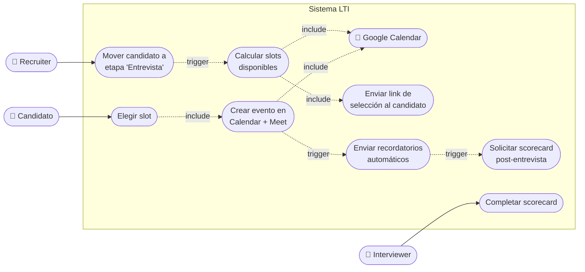
```mermaid
flowchart LR
    RC(["👤 Recruiter"])
    CA(["👤 Candidato"])
    IV(["👤 Interviewer"])
    GC(["📅 Google Calendar"])

    subgraph LTI["Sistema LTI"]
        UC1(["Mover candidato a<br/>etapa 'Entrevista'"])
        UC2(["Calcular slots<br/>disponibles"])
        UC3(["Enviar link de<br/>selección al candidato"])
        UC4(["Elegir slot"])
        UC5(["Crear evento en<br/>Calendar + Meet"])
        UC6(["Enviar recordatorios<br/>automáticos"])
        UC7(["Solicitar scorecard<br/>post-entrevista"])
        UC8(["Completar scorecard"])

        UC1 -.->|trigger| UC2
        UC2 -.->|include| GC
        UC2 -.->|include| UC3
        UC4 -.->|include| UC5
        UC5 -.->|include| GC
        UC5 -.->|trigger| UC6
        UC6 -.->|trigger| UC7
    end

    RC --> UC1
    CA --> UC4
    IV --> UC8
```

---

### 3.3 Caso de uso 3 — Cierre de vacante: oferta, firma y onboarding

**Actores**: Recruiter, Hiring Manager (aprobador), Candidato seleccionado, DocuSign.

**Precondiciones**: candidato en etapa "Oferta", scorecard final positivo, salary band aprobado.

**Flujo principal**:
1. Recruiter genera carta oferta desde plantilla del tenant (campos auto-completados: nombre, rol, salario, fecha de inicio).
2. Workflow de aprobación: Hiring Manager debe aprobar dentro del sistema. Recibe notificación in-app y email.
3. Una vez aprobada, LTI envía la oferta a DocuSign para firma electrónica.
4. Candidato recibe email de DocuSign, firma desde el navegador.
5. Webhook de DocuSign notifica a LTI que la oferta fue firmada.
6. LTI **automáticamente**:
   - Mueve el candidato a estado "Hired" y cierra la vacante.
   - Crea registro de empleado en módulo de Onboarding.
   - Genera checklist pre-primer-día (firma de docs adicionales, datos bancarios, foto, equipamiento).
   - Envía welcome email con acceso al portal de onboarding.
7. Candidato completa checklist días previos a su ingreso. IT y HR del tenant ven el progreso.

**Postcondiciones**: vacante cerrada, candidato es empleado activo, onboarding en progreso.

**Diagrama de caso de uso**:

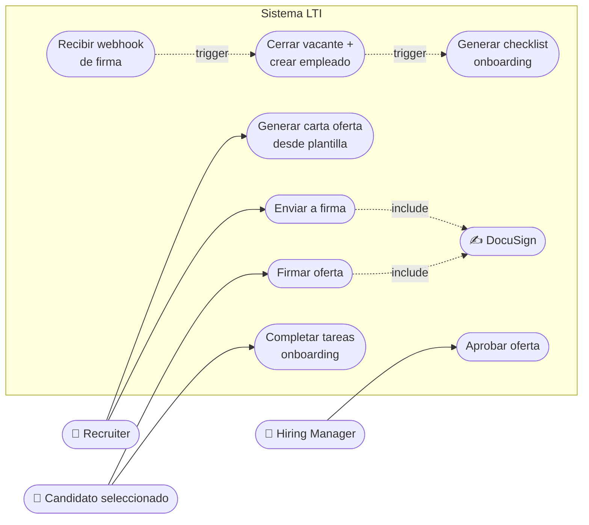
```mermaid
flowchart LR
    RC(["👤 Recruiter"])
    HM(["👤 Hiring Manager"])
    CA(["👤 Candidato seleccionado"])
    DS(["✍️ DocuSign"])

    subgraph LTI["Sistema LTI"]
        UC1(["Generar carta oferta<br/>desde plantilla"])
        UC2(["Aprobar oferta"])
        UC3(["Enviar a firma"])
        UC4(["Firmar oferta"])
        UC5(["Recibir webhook<br/>de firma"])
        UC6(["Cerrar vacante +<br/>crear empleado"])
        UC7(["Generar checklist<br/>onboarding"])
        UC8(["Completar tareas<br/>onboarding"])

        UC3 -.->|include| DS
        UC4 -.->|include| DS
        UC5 -.->|trigger| UC6
        UC6 -.->|trigger| UC7
    end

    RC --> UC1
    HM --> UC2
    RC --> UC3
    CA --> UC4
    CA --> UC8
```

---

## 4. Customer Journey del candidato

Documentamos el journey del candidato porque su experiencia es **producto, no soporte**: un candidato que tiene buena experiencia se transforma en talent pool reutilizable y en marca empleadora del tenant.

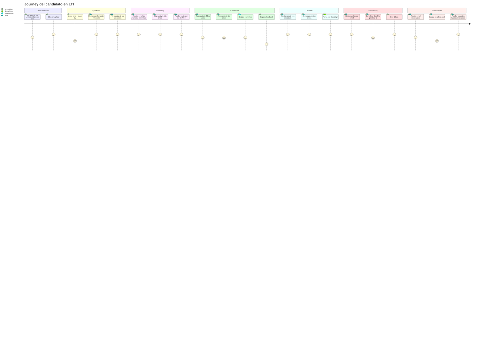
```mermaid
journey
    title Journey del candidato en LTI
    section Descubrimiento
      Ve vacante en LinkedIn/Careers Site: 4: Candidato
      Click en aplicar: 5: Candidato
    section Aplicación
      Llena form + sube CV: 3: Candidato
      Recibe confirmación inmediata: 5: Candidato, LTI
      Ve estado de su aplicación: 5: Candidato, LTI
    section Screening
      Recibe email de avance a entrevista: 5: Candidato, LTI
      Elige slot vía link único: 5: Candidato, LTI
      Recibe invite con link de Meet: 5: Candidato, LTI
    section Entrevistas
      Recordatorio 24hs antes: 4: Candidato, LTI
      Recordatorio 1hr antes: 4: Candidato, LTI
      Realiza entrevista: 4: Candidato, Interviewer
      Espera feedback: 2: Candidato
    section Decisión
      Recibe email con resultado: 5: Candidato, LTI
      Si avanza, recibe oferta: 5: Candidato, LTI
      Firma vía DocuSign: 5: Candidato, DocuSign
    section Onboarding
      Recibe welcome email: 5: Candidato, LTI
      Completa checklist pre-Day-1: 4: Candidato, LTI
      Day 1 listo: 5: Candidato
    section Si no avanza
      Recibe email respetuoso: 4: Candidato, LTI
      Queda en talent pool: 3: Candidato, LTI
      Recibe vacantes futuras relevantes: 5: Candidato, LTI
```

**Puntos críticos del journey** (donde LTI marca diferencia vs competidores):

- **Sin "limbo"**: el candidato siempre sabe en qué etapa está. Esto es el dolor #1 reportado en encuestas de candidate experience.
- **Auto-scheduling**: elimina el ida y vuelta de mails para coordinar entrevista (en promedio 4-6 mensajes).
- **Talent pool activo**: aunque no quede para esta vacante, recibe oportunidades futuras relevantes — lo que convierte el "no" en lead frío con valor.

---

## 5. Modelo de datos (DER)

El modelo está diseñado para SaaS multi-tenant con `tenant_id` en todas las tablas operativas. Para mantener la legibilidad, lo dividimos en **4 vistas por bounded context** + una vista de tablas transversales.

### 5.1 Convenciones del modelo

- **Tipos**: notación Postgres (`uuid`, `text`, `varchar`, `timestamptz`, `numeric`, `jsonb`, `vector`).
- **PK**: clave primaria. **FK**: foreign key. **UK**: unique key.
- **Timestamps**: todas las tablas operativas tienen `created_at` y `updated_at` (omitidos en diagramas por concisión, salvo cuando son semánticamente relevantes).
- **Multi-tenancy**: `tenant_id` está en todas las tablas operativas; aislamiento en aplicación vía middleware Prisma.
- **Soft deletes**: no se implementan en MVP. Estados como `REJECTED`, `WITHDRAWN`, `CLOSED` cumplen ese rol y satisfacen retención de auditoría exigida por Ley 25.326.

### 5.2 Vista 1 — Identidad y tenancy

Tablas que gestionan tenants, usuarios y roles.

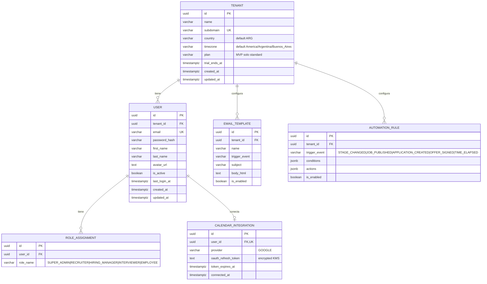
```mermaid
erDiagram
    TENANT ||--o{ USER : "tiene"
    USER ||--o{ ROLE_ASSIGNMENT : "tiene"
    USER ||--o| CALENDAR_INTEGRATION : "conecta"
    TENANT ||--o{ EMAIL_TEMPLATE : "configura"
    TENANT ||--o{ AUTOMATION_RULE : "configura"

    TENANT {
        uuid id PK
        varchar name
        varchar subdomain UK
        varchar country "default ARG"
        varchar timezone "default America/Argentina/Buenos_Aires"
        varchar plan "MVP solo standard"
        timestamptz trial_ends_at
        timestamptz created_at
        timestamptz updated_at
    }

    USER {
        uuid id PK
        uuid tenant_id FK
        varchar email UK
        varchar password_hash
        varchar first_name
        varchar last_name
        text avatar_url
        boolean is_active
        timestamptz last_login_at
        timestamptz created_at
        timestamptz updated_at
    }

    ROLE_ASSIGNMENT {
        uuid id PK
        uuid user_id FK
        varchar role_name "SUPER_ADMIN|RECRUITER|HIRING_MANAGER|INTERVIEWER|EMPLOYEE"
    }

    CALENDAR_INTEGRATION {
        uuid id PK
        uuid user_id FK,UK
        varchar provider "GOOGLE"
        text oauth_refresh_token "encrypted KMS"
        timestamptz token_expires_at
        timestamptz connected_at
    }

    EMAIL_TEMPLATE {
        uuid id PK
        uuid tenant_id FK
        varchar name
        varchar trigger_event
        varchar subject
        text body_html
        boolean is_enabled
    }

    AUTOMATION_RULE {
        uuid id PK
        uuid tenant_id FK
        varchar trigger_event "STAGE_CHANGED|JOB_PUBLISHED|APPLICATION_CREATED|OFFER_SIGNED|TIME_ELAPSED"
        jsonb conditions
        jsonb actions
        boolean is_enabled
    }
```

### 5.3 Vista 2 — Recruitment (vacantes, pipeline, aplicaciones)

Núcleo del ATS.

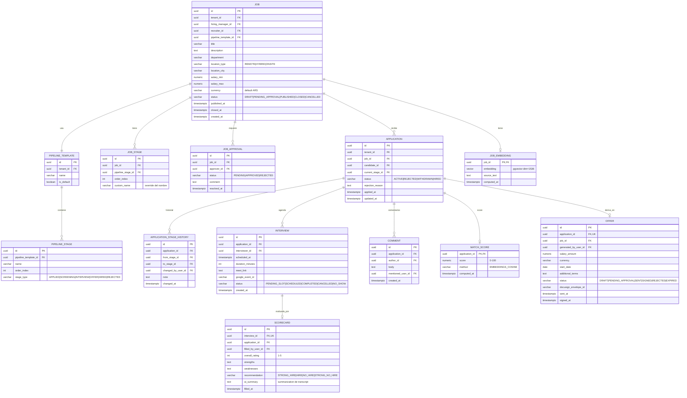
```mermaid
erDiagram
    JOB ||--|| PIPELINE_TEMPLATE : "usa"
    JOB ||--o{ JOB_STAGE : "tiene"
    JOB ||--o{ JOB_APPROVAL : "requiere"
    JOB ||--o{ APPLICATION : "recibe"
    JOB ||--o| JOB_EMBEDDING : "tiene"

    PIPELINE_TEMPLATE ||--o{ PIPELINE_STAGE : "contiene"

    APPLICATION ||--o{ APPLICATION_STAGE_HISTORY : "historial"
    APPLICATION ||--o{ INTERVIEW : "agenda"
    APPLICATION ||--o{ COMMENT : "comentarios"
    APPLICATION ||--o| MATCH_SCORE : "score"
    APPLICATION ||--o| OFFER : "deriva_en"

    INTERVIEW ||--o| SCORECARD : "evaluada_por"

    JOB {
        uuid id PK
        uuid tenant_id FK
        uuid hiring_manager_id FK
        uuid recruiter_id FK
        uuid pipeline_template_id FK
        varchar title
        text description
        varchar department
        varchar location_type "REMOTE|HYBRID|ONSITE"
        varchar location_city
        numeric salary_min
        numeric salary_max
        varchar currency "default ARS"
        varchar status "DRAFT|PENDING_APPROVAL|PUBLISHED|CLOSED|CANCELLED"
        timestamptz published_at
        timestamptz closed_at
        timestamptz created_at
    }

    JOB_EMBEDDING {
        uuid job_id PK,FK
        vector embedding "pgvector dim=1536"
        text source_text
        timestamptz computed_at
    }

    JOB_APPROVAL {
        uuid id PK
        uuid job_id FK
        uuid approver_id FK
        varchar status "PENDING|APPROVED|REJECTED"
        text comment
        timestamptz resolved_at
    }

    PIPELINE_TEMPLATE {
        uuid id PK
        uuid tenant_id FK
        varchar name
        boolean is_default
    }

    PIPELINE_STAGE {
        uuid id PK
        uuid pipeline_template_id FK
        varchar name
        int order_index
        varchar stage_type "APPLIED|SCREENING|INTERVIEW|OFFER|HIRED|REJECTED"
    }

    JOB_STAGE {
        uuid id PK
        uuid job_id FK
        uuid pipeline_stage_id FK
        int order_index
        varchar custom_name "override del nombre"
    }

    APPLICATION {
        uuid id PK
        uuid tenant_id FK
        uuid job_id FK
        uuid candidate_id FK
        uuid current_stage_id FK
        varchar status "ACTIVE|REJECTED|WITHDRAWN|HIRED"
        text rejection_reason
        timestamptz applied_at
        timestamptz updated_at
    }

    MATCH_SCORE {
        uuid application_id PK,FK
        numeric score "0-100"
        varchar method "EMBEDDINGS_COSINE"
        timestamptz computed_at
    }

    APPLICATION_STAGE_HISTORY {
        uuid id PK
        uuid application_id FK
        uuid from_stage_id FK
        uuid to_stage_id FK
        uuid changed_by_user_id FK
        text note
        timestamptz changed_at
    }

    INTERVIEW {
        uuid id PK
        uuid application_id FK
        uuid interviewer_id FK
        timestamptz scheduled_at
        int duration_minutes
        text meet_link
        varchar google_event_id
        varchar status "PENDING_SLOT|SCHEDULED|COMPLETED|CANCELLED|NO_SHOW"
        timestamptz created_at
    }

    SCORECARD {
        uuid id PK
        uuid interview_id FK,UK
        uuid application_id FK
        uuid filled_by_user_id FK
        int overall_rating "1-5"
        text strengths
        text weaknesses
        varchar recommendation "STRONG_HIRE|HIRE|NO_HIRE|STRONG_NO_HIRE"
        text ai_summary "summarization de transcript"
        timestamptz filled_at
    }

    COMMENT {
        uuid id PK
        uuid application_id FK
        uuid author_id FK
        text body
        uuid mentioned_user_id FK
        timestamptz created_at
    }

    OFFER {
        uuid id PK
        uuid application_id FK,UK
        uuid job_id FK
        uuid generated_by_user_id FK
        numeric salary_amount
        varchar currency
        date start_date
        text additional_terms
        varchar status "DRAFT|PENDING_APPROVAL|SENT|SIGNED|REJECTED|EXPIRED"
        varchar docusign_envelope_id
        timestamptz sent_at
        timestamptz signed_at
    }
```

### 5.4 Vista 3 — Talent CRM y candidatos

Repositorio de candidatos, talent pool, embeddings, documentos.

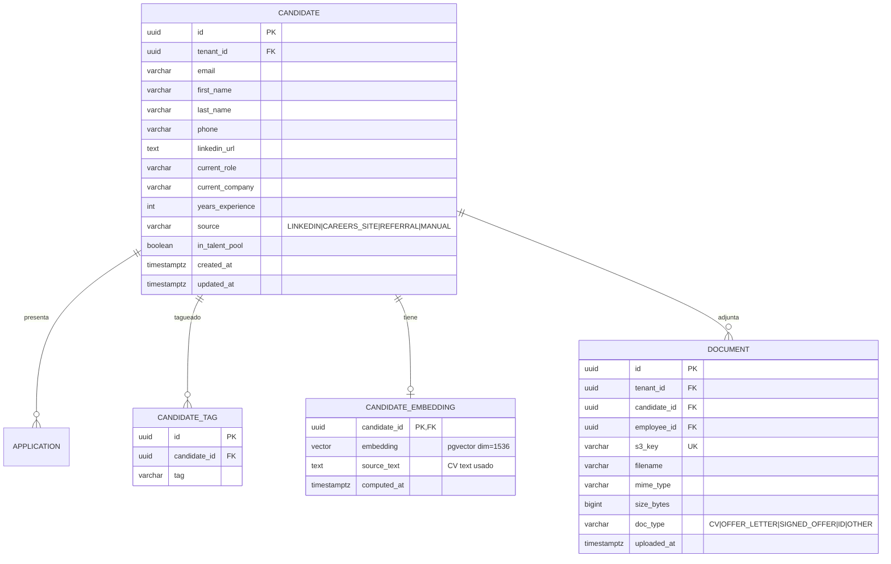
```mermaid
erDiagram
    CANDIDATE ||--o{ APPLICATION : "presenta"
    CANDIDATE ||--o{ CANDIDATE_TAG : "tagueado"
    CANDIDATE ||--o| CANDIDATE_EMBEDDING : "tiene"
    CANDIDATE ||--o{ DOCUMENT : "adjunta"

    CANDIDATE {
        uuid id PK
        uuid tenant_id FK
        varchar email
        varchar first_name
        varchar last_name
        varchar phone
        text linkedin_url
        varchar current_role
        varchar current_company
        int years_experience
        varchar source "LINKEDIN|CAREERS_SITE|REFERRAL|MANUAL"
        boolean in_talent_pool
        timestamptz created_at
        timestamptz updated_at
    }

    CANDIDATE_TAG {
        uuid id PK
        uuid candidate_id FK
        varchar tag
    }

    CANDIDATE_EMBEDDING {
        uuid candidate_id PK,FK
        vector embedding "pgvector dim=1536"
        text source_text "CV text usado"
        timestamptz computed_at
    }

    DOCUMENT {
        uuid id PK
        uuid tenant_id FK
        uuid candidate_id FK
        uuid employee_id FK
        varchar s3_key UK
        varchar filename
        varchar mime_type
        bigint size_bytes
        varchar doc_type "CV|OFFER_LETTER|SIGNED_OFFER|ID|OTHER"
        timestamptz uploaded_at
    }
```

**Notas**:
- `(tenant_id, email)` en `CANDIDATE` tiene índice único parcial: dos tenants distintos pueden tener candidatos con el mismo email (un candidato aplica a varias empresas).
- Índice IVFFlat sobre `CANDIDATE_EMBEDDING.embedding` con `lists=100` para búsqueda por similitud.

### 5.5 Vista 4 — Onboarding y empleados

Post-firma de oferta.

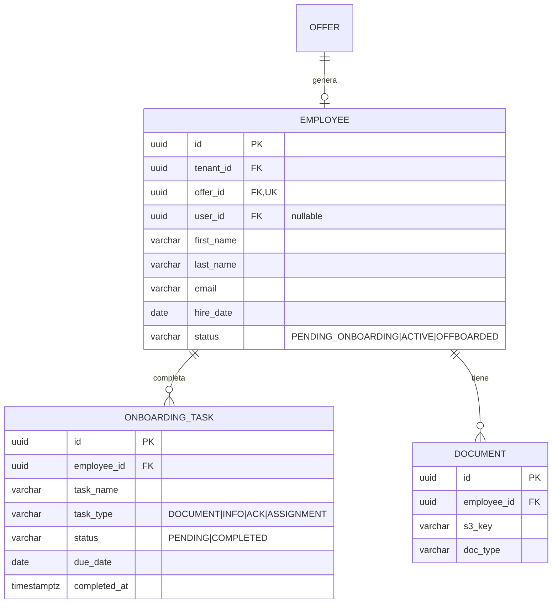
```mermaid
erDiagram
    OFFER ||--o| EMPLOYEE : "genera"
    EMPLOYEE ||--o{ ONBOARDING_TASK : "completa"
    EMPLOYEE ||--o{ DOCUMENT : "tiene"

    EMPLOYEE {
        uuid id PK
        uuid tenant_id FK
        uuid offer_id FK,UK
        uuid user_id FK "nullable"
        varchar first_name
        varchar last_name
        varchar email
        date hire_date
        varchar status "PENDING_ONBOARDING|ACTIVE|OFFBOARDED"
    }

    ONBOARDING_TASK {
        uuid id PK
        uuid employee_id FK
        varchar task_name
        varchar task_type "DOCUMENT|INFO|ACK|ASSIGNMENT"
        varchar status "PENDING|COMPLETED"
        date due_date
        timestamptz completed_at
    }

    DOCUMENT {
        uuid id PK
        uuid employee_id FK
        varchar s3_key
        varchar doc_type
    }
```

### 5.6 Vista 5 — Automation Engine y eventos

Tablas que soportan el motor de automatizaciones.

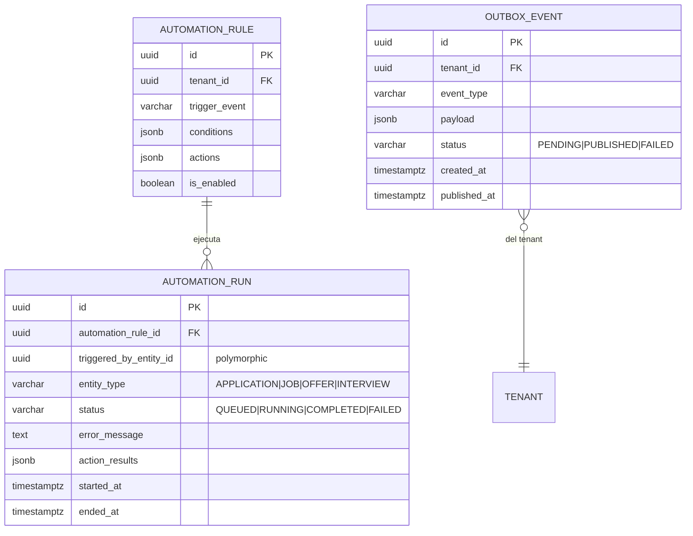
```mermaid
erDiagram
    AUTOMATION_RULE ||--o{ AUTOMATION_RUN : "ejecuta"
    OUTBOX_EVENT }o--|| TENANT : "del tenant"

    AUTOMATION_RULE {
        uuid id PK
        uuid tenant_id FK
        varchar trigger_event
        jsonb conditions
        jsonb actions
        boolean is_enabled
    }

    AUTOMATION_RUN {
        uuid id PK
        uuid automation_rule_id FK
        uuid triggered_by_entity_id "polymorphic"
        varchar entity_type "APPLICATION|JOB|OFFER|INTERVIEW"
        varchar status "QUEUED|RUNNING|COMPLETED|FAILED"
        text error_message
        jsonb action_results
        timestamptz started_at
        timestamptz ended_at
    }

    OUTBOX_EVENT {
        uuid id PK
        uuid tenant_id FK
        varchar event_type
        jsonb payload
        varchar status "PENDING|PUBLISHED|FAILED"
        timestamptz created_at
        timestamptz published_at
    }
```

### 5.7 Índices clave

Aunque no son representables en DER, son críticos para performance:

| Tabla | Índice | Razón |
|---|---|---|
| `JOB` | `(tenant_id, status)` | Listar vacantes activas por tenant |
| `APPLICATION` | `(tenant_id, applied_at DESC)` | Listado y reportes |
| `APPLICATION` | `(job_id, current_stage_id)` | Render de pipeline kanban |
| `CANDIDATE` | `(tenant_id, email)` UNIQUE | Deduplicación |
| `CANDIDATE_EMBEDDING` | IVFFlat sobre `embedding` con `lists=100` | Similitud semántica |
| `JOB_EMBEDDING` | IVFFlat sobre `embedding` con `lists=50` | Matching de candidatos a job |
| `OUTBOX_EVENT` | `(status, created_at)` parcial donde `status='PENDING'` | Drainer eficiente |
| `AUTOMATION_RUN` | `(automation_rule_id, started_at DESC)` | Auditoría |

---

## 6. Diseño del sistema a alto nivel

### 6.1 Arquitectura — Modular Monolith con servicios auxiliares

Adoptamos **Modular Monolith** como arquitectura principal del MVP por las siguientes razones:

- **Velocidad de desarrollo**: equipo chico (4 ingenieros), prioridad time-to-market.
- **Simplicidad operacional**: un solo servicio principal a deployar y monitorear.
- **Costo**: ECS Fargate corriendo un solo servicio + workers cuesta ~5x menos que microservicios.
- **Domain Driven**: cada módulo (Recruitment, Talent CRM, Onboarding, Automation, AI) tiene fronteras claras a nivel de código, lo que permite extraer a microservicio cuando escale.

**Excepciones extraídas como servicios independientes**:
- **AI Worker**: workloads de embeddings, generación, summarization corren en workers separados consumiendo de SQS para no bloquear el monolito.
- **Automation Worker**: el motor de ejecución de automatizaciones también es un worker para escalar independientemente.
- **Email Worker**: aislamiento de envío de emails para evitar que un pico bloquee el API.

### 6.2 Diagrama de alto nivel (lógico)

Para mantener legibilidad, lo dividimos en dos vistas: **plano de aplicación** y **plano de datos + integraciones**.

#### 6.2.1 Plano de aplicación (qué corre dónde)

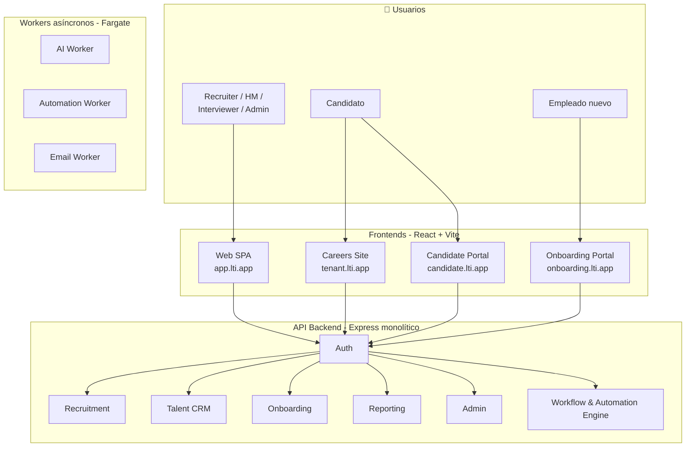
```mermaid
flowchart TB
    subgraph Users["👥 Usuarios"]
        U1[Recruiter / HM /<br/>Interviewer / Admin]
        U2[Candidato]
        U3[Empleado nuevo]
    end

    subgraph Frontends["Frontends - React + Vite"]
        SPA[Web SPA<br/>app.lti.app]
        CAREERS[Careers Site<br/>tenant.lti.app]
        CANDPORTAL[Candidate Portal<br/>candidate.lti.app]
        ONBPORTAL[Onboarding Portal<br/>onboarding.lti.app]
    end

    subgraph BackendAPI["API Backend - Express monolítico"]
        AUTH[Auth]
        RECR[Recruitment]
        TALENT[Talent CRM]
        ONB[Onboarding]
        REPORT[Reporting]
        ADMIN[Admin]
        WAE[Workflow & Automation Engine]
    end

    subgraph Workers["Workers asíncronos - Fargate"]
        AIW[AI Worker]
        AUTOW[Automation Worker]
        EMAILW[Email Worker]
    end

    U1 --> SPA
    U2 --> CAREERS
    U2 --> CANDPORTAL
    U3 --> ONBPORTAL

    SPA & CAREERS & CANDPORTAL & ONBPORTAL --> AUTH
    AUTH --> RECR & TALENT & ONB & REPORT & ADMIN & WAE
```

#### 6.2.2 Plano de datos e integraciones

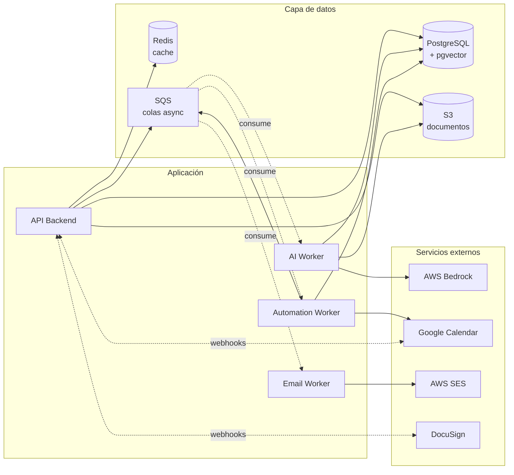
```mermaid
flowchart LR
    subgraph App["Aplicación"]
        API[API Backend]
        AIW[AI Worker]
        AUTOW[Automation Worker]
        EMAILW[Email Worker]
    end

    subgraph Data["Capa de datos"]
        PG[(PostgreSQL<br/>+ pgvector)]
        S3[(S3<br/>documentos)]
        REDIS[(Redis<br/>cache)]
        SQS[SQS<br/>colas async]
    end

    subgraph External["Servicios externos"]
        BEDROCK[AWS Bedrock]
        GCAL[Google Calendar]
        SES[AWS SES]
        DOCU[DocuSign]
    end

    API --> PG & REDIS & S3 & SQS
    AIW --> PG & S3 & BEDROCK
    AUTOW --> PG & GCAL & SQS
    EMAILW --> SES

    SQS -.consume.-> AIW
    SQS -.consume.-> AUTOW
    SQS -.consume.-> EMAILW

    API <-.webhooks.-> DOCU
    API <-.webhooks.-> GCAL
```

### 6.3 Principios de diseño

- **Separación clara de responsabilidades** por módulo dentro del monolito. Cada módulo expone una interfaz; ningún módulo accede a tablas de otro directamente.
- **Async-first** para todo lo que no es respuesta síncrona al usuario: parsing, embeddings, emails, automatizaciones, llamadas a IA.
- **Idempotencia** en todos los workers: cada job tiene `idempotency_key`. Reintentos no causan efectos duplicados.
- **Tenant isolation** en cada query vía middleware Prisma + verificación cross-tenant.
- **Stateless backend**: nada de estado en memoria; todo a Redis o Postgres.
- **Outbox pattern** para garantizar atomicidad entre cambios DB y publicación de eventos de dominio.

---

## 7. Arquitectura C4

Recorremos los niveles del modelo C4: Contexto, Contenedores y Componentes. Profundizamos a nivel Component en el módulo elegido: **Workflow & Automation Engine** (corazón del diferenciador "Eficiencia HR + Automatizaciones"). Incluimos también un **diagrama de despliegue** (sección 8) y un **diagrama de clases complementario** (no es parte de C4, pero detalla el componente más complejo del Engine).

### 7.1 C4 Nivel 1 — Diagrama de Contexto

Muestra el sistema LTI como una caja negra y sus actores e integraciones.

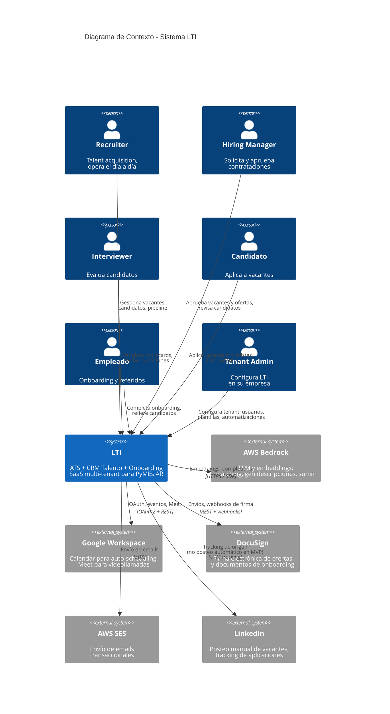
```mermaid
C4Context
    title Diagrama de Contexto - Sistema LTI

    Person(recruiter, "Recruiter", "Talent acquisition,<br/>opera el día a día")
    Person(hm, "Hiring Manager", "Solicita y aprueba<br/>contrataciones")
    Person(interviewer, "Interviewer", "Evalúa candidatos")
    Person(candidate, "Candidato", "Aplica a vacantes")
    Person(employee, "Empleado", "Onboarding y referidos")
    Person(admin, "Tenant Admin", "Configura LTI<br/>en su empresa")

    System(lti, "LTI", "ATS + CRM Talento + Onboarding<br/>SaaS multi-tenant para PyMEs AR")

    System_Ext(bedrock, "AWS Bedrock", "LLM y embeddings:<br/>matching, gen descripciones, summ")
    System_Ext(gworkspace, "Google Workspace", "Calendar para auto-scheduling,<br/>Meet para videollamadas")
    System_Ext(docusign, "DocuSign", "Firma electrónica de ofertas<br/>y documentos de onboarding")
    System_Ext(ses, "AWS SES", "Envío de emails<br/>transaccionales")
    System_Ext(linkedin, "LinkedIn", "Posteo manual de vacantes,<br/>tracking de aplicaciones")

    Rel(recruiter, lti, "Gestiona vacantes,<br/>candidatos, pipeline")
    Rel(hm, lti, "Aprueba vacantes y ofertas,<br/>revisa candidatos")
    Rel(interviewer, lti, "Completa scorecards,<br/>recibe invitaciones")
    Rel(candidate, lti, "Aplica, agenda entrevistas,<br/>firma oferta")
    Rel(employee, lti, "Completa onboarding,<br/>refiere candidatos")
    Rel(admin, lti, "Configura tenant, usuarios,<br/>plantillas, automatizaciones")

    Rel(lti, bedrock, "Embeddings, completions", "HTTPS / SDK")
    Rel(lti, gworkspace, "OAuth, eventos, Meet", "OAuth2 + REST")
    Rel(lti, docusign, "Envíos, webhooks de firma", "REST + webhooks")
    Rel(lti, ses, "Envío de emails", "SDK")
    Rel(lti, linkedin, "Tracking de origen<br/>(no posteo automático en MVP)", "UTM tracking")
```

---

### 7.2 C4 Nivel 2 — Diagrama de Contenedores

Para mejor legibilidad lo separamos en dos sub-diagramas: **Frontends + API + Datos** y **Workers + Colas + Externos**.

#### 7.2.1 Sub-diagrama A: Frontends, API y datos

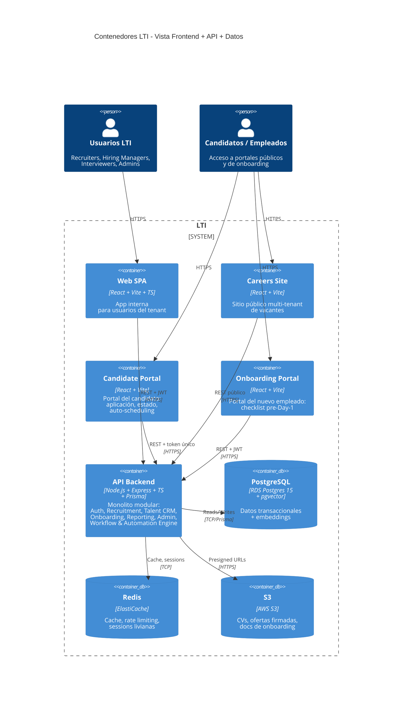
```mermaid
C4Container
    title Contenedores LTI - Vista Frontend + API + Datos

    Person(user, "Usuarios LTI", "Recruiters, Hiring Managers,<br/>Interviewers, Admins")
    Person(candidate, "Candidatos / Empleados", "Acceso a portales públicos<br/>y de onboarding")

    System_Boundary(lti, "LTI") {
        Container(spa, "Web SPA", "React + Vite + TS", "App interna<br/>para usuarios del tenant")
        Container(careers, "Careers Site", "React + Vite", "Sitio público multi-tenant<br/>de vacantes")
        Container(candportal, "Candidate Portal", "React + Vite", "Portal del candidato:<br/>aplicación, estado,<br/>auto-scheduling")
        Container(onbportal, "Onboarding Portal", "React + Vite", "Portal del nuevo empleado:<br/>checklist pre-Day-1")

        Container(api, "API Backend", "Node.js + Express + TS<br/>+ Prisma", "Monolito modular:<br/>Auth, Recruitment, Talent CRM,<br/>Onboarding, Reporting, Admin,<br/>Workflow & Automation Engine")

        ContainerDb(pg, "PostgreSQL", "RDS Postgres 15<br/>+ pgvector", "Datos transaccionales<br/>+ embeddings")
        ContainerDb(redis, "Redis", "ElastiCache", "Cache, rate limiting,<br/>sessions livianas")
        ContainerDb(s3, "S3", "AWS S3", "CVs, ofertas firmadas,<br/>docs de onboarding")
    }

    Rel(user, spa, "HTTPS")
    Rel(candidate, careers, "HTTPS")
    Rel(candidate, candportal, "HTTPS")
    Rel(candidate, onbportal, "HTTPS")

    Rel(spa, api, "REST + JWT", "HTTPS")
    Rel(careers, api, "REST público", "HTTPS")
    Rel(candportal, api, "REST + token único", "HTTPS")
    Rel(onbportal, api, "REST + JWT", "HTTPS")

    Rel(api, pg, "Reads/Writes", "TCP/Prisma")
    Rel(api, redis, "Cache, sessions", "TCP")
    Rel(api, s3, "Presigned URLs", "HTTPS")
```

#### 7.2.2 Sub-diagrama B: Workers, colas y servicios externos

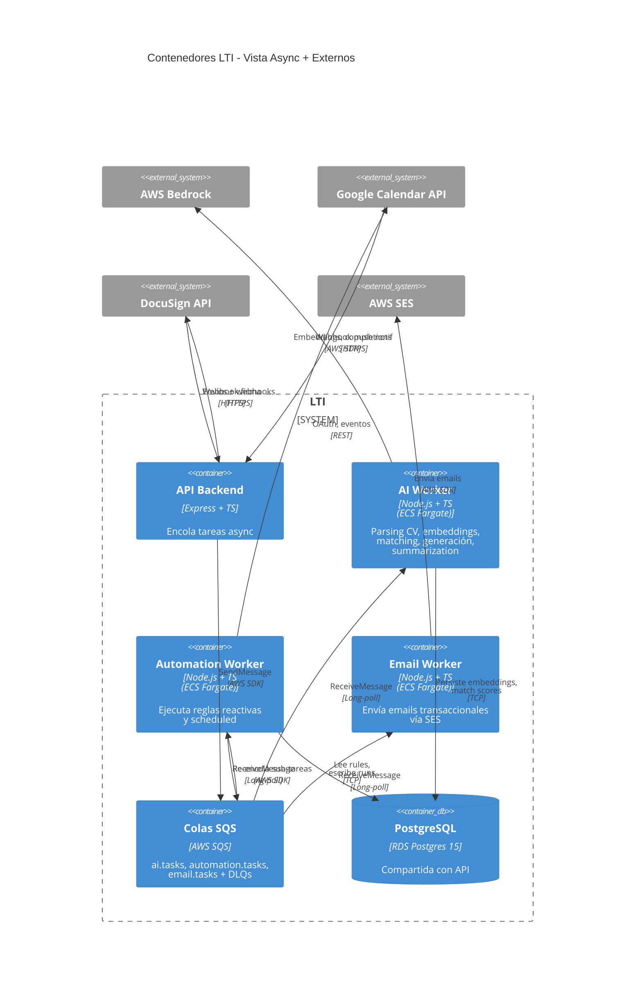
```mermaid
C4Container
    title Contenedores LTI - Vista Async + Externos

    System_Boundary(lti, "LTI") {
        Container(api, "API Backend", "Express + TS", "Encola tareas async")

        Container(aiworker, "AI Worker", "Node.js + TS<br/>(ECS Fargate)", "Parsing CV, embeddings,<br/>matching, generación,<br/>summarization")
        Container(autoworker, "Automation Worker", "Node.js + TS<br/>(ECS Fargate)", "Ejecuta reglas reactivas<br/>y scheduled")
        Container(emailworker, "Email Worker", "Node.js + TS<br/>(ECS Fargate)", "Envía emails transaccionales<br/>vía SES")

        Container(sqs, "Colas SQS", "AWS SQS", "ai.tasks, automation.tasks,<br/>email.tasks + DLQs")
        ContainerDb(pg, "PostgreSQL", "RDS Postgres 15", "Compartida con API")
    }

    System_Ext(bedrock, "AWS Bedrock")
    System_Ext(gcal, "Google Calendar API")
    System_Ext(docusign, "DocuSign API")
    System_Ext(ses, "AWS SES")

    Rel(api, sqs, "SendMessage", "AWS SDK")
    Rel(api, docusign, "Envíos + webhooks", "HTTPS")
    Rel(docusign, api, "Webhook firma", "HTTPS")
    Rel(gcal, api, "Webhook push notif", "HTTPS")

    Rel(sqs, aiworker, "ReceiveMessage", "Long-poll")
    Rel(sqs, autoworker, "ReceiveMessage", "Long-poll")
    Rel(sqs, emailworker, "ReceiveMessage", "Long-poll")

    Rel(aiworker, bedrock, "Embeddings, completions", "AWS SDK")
    Rel(aiworker, pg, "Persiste embeddings,<br/>match scores", "TCP")
    Rel(autoworker, gcal, "OAuth, eventos", "REST")
    Rel(autoworker, pg, "Lee rules,<br/>escribe runs", "TCP")
    Rel(autoworker, sqs, "Re-encola sub-tareas", "AWS SDK")
    Rel(emailworker, ses, "Envía emails", "AWS SDK")
```

---

### 7.3 C4 Nivel 3 — Diagrama de Componentes del Workflow & Automation Engine

Bajamos al detalle del **Workflow & Automation Engine**, que es el componente que más concentra el diferenciador de LTI. Este motor vive parcialmente dentro del monolito (API) y parcialmente en el Automation Worker.

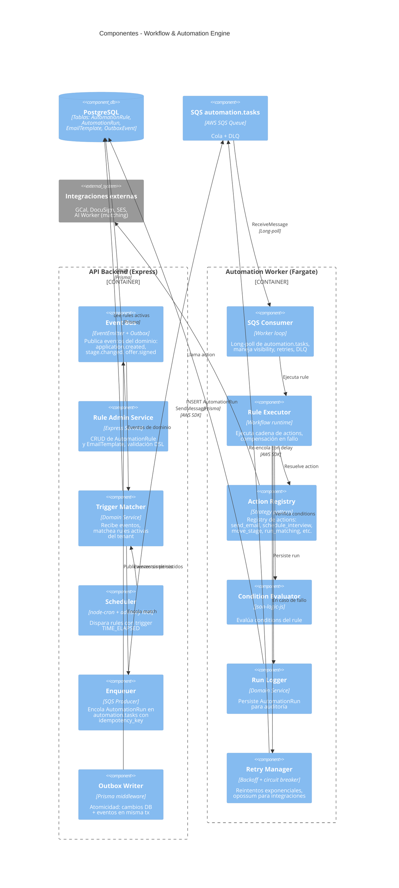
```mermaid
C4Component
    title Componentes - Workflow & Automation Engine

    Container_Boundary(api, "API Backend (Express)") {
        Component(eventbus, "Event Bus", "EventEmitter + Outbox", "Publica eventos del dominio:<br/>application.created,<br/>stage.changed, offer.signed")
        Component(ruleadmin, "Rule Admin Service", "Express Service", "CRUD de AutomationRule<br/>y EmailTemplate, validación DSL")
        Component(triggermatch, "Trigger Matcher", "Domain Service", "Recibe eventos,<br/>matchea rules activas<br/>del tenant")
        Component(scheduler, "Scheduler", "node-cron + advisory lock", "Dispara rules con trigger<br/>TIME_ELAPSED")
        Component(enqueuer, "Enqueuer", "SQS Producer", "Encola AutomationRun en<br/>automation.tasks con<br/>idempotency_key")
        Component(outbox, "Outbox Writer", "Prisma middleware", "Atomicidad: cambios DB<br/>+ eventos en misma tx")
    }

    Container_Boundary(autoworker, "Automation Worker (Fargate)") {
        Component(consumer, "SQS Consumer", "Worker loop", "Long-poll de automation.tasks,<br/>maneja visibility, retries, DLQ")
        Component(executor, "Rule Executor", "Workflow runtime", "Ejecuta cadena de actions,<br/>compensación en fallo")
        Component(actionreg, "Action Registry", "Strategy pattern", "Registry de actions:<br/>send_email, schedule_interview,<br/>move_stage, run_matching, etc.")
        Component(condeval, "Condition Evaluator", "json-logic-js", "Evalúa conditions del rule")
        Component(runlogger, "Run Logger", "Domain Service", "Persiste AutomationRun<br/>para auditoría")
        Component(retrymgr, "Retry Manager", "Backoff + circuit breaker", "Reintentos exponenciales,<br/>opossum para integraciones")
    }

    ComponentDb(pgrules, "PostgreSQL", "Tablas: AutomationRule,<br/>AutomationRun,<br/>EmailTemplate, OutboxEvent")
    Component(sqsauto, "SQS automation.tasks", "AWS SQS Queue", "Cola + DLQ")

    System_Ext(integrations, "Integraciones externas", "GCal, DocuSign, SES,<br/>AI Worker (matching)")

    Rel(eventbus, triggermatch, "Eventos de dominio")
    Rel(scheduler, triggermatch, "Eventos sintéticos")
    Rel(triggermatch, pgrules, "Lee rules activas", "Prisma")
    Rel(triggermatch, enqueuer, "Encola match")
    Rel(enqueuer, sqsauto, "SendMessage", "AWS SDK")
    Rel(ruleadmin, pgrules, "CRUD", "Prisma")
    Rel(outbox, eventbus, "Publica eventos persistidos")

    Rel(sqsauto, consumer, "ReceiveMessage", "Long-poll")
    Rel(consumer, executor, "Ejecuta rule")
    Rel(executor, condeval, "Verifica conditions")
    Rel(executor, actionreg, "Resuelve action")
    Rel(actionreg, integrations, "Llama action")
    Rel(executor, retrymgr, "En caso de fallo")
    Rel(executor, runlogger, "Persiste run")
    Rel(runlogger, pgrules, "INSERT AutomationRun", "Prisma")
    Rel(retrymgr, sqsauto, "Re-encola con delay", "AWS SDK")
```

#### 7.3.1 Detalle de cada componente

| Componente | Responsabilidad | Tecnología | Notas técnicas |
|---|---|---|---|
| **Event Bus** | Punto único donde el resto del sistema publica eventos de dominio. | `EventEmitter` de Node + patrón Outbox para atomicidad. | Eventos: `application.created`, `application.stage_changed`, `job.published`, `job.aged_30d`, `interview.scheduled`, `interview.completed`, `offer.signed`. |
| **Outbox Writer** | Garantiza que un cambio en DB y la publicación de su evento son atómicos. | Middleware Prisma + tabla `outbox_events` + drainer. | Evita inconsistencias del estilo "guardé el cambio pero el evento se perdió". |
| **Rule Admin Service** | CRUD de reglas y plantillas de email. Validación del DSL. | Express controller. | DSL en JSONB: `{trigger, conditions: JsonLogic, actions: [{type, params}]}`. |
| **Trigger Matcher** | Recibe eventos del bus y decide qué reglas se disparan. | Domain Service in-process. | Filtra por `tenant_id`, `trigger_event`, evalúa pre-condiciones rápidas. |
| **Scheduler** | Dispara reglas time-based (vacantes viejas, recordatorios). | `node-cron` con `pg_advisory_lock` distribuido. | Solo una instancia del API ejecuta el scheduler en cada tick. |
| **Enqueuer** | Encola la ejecución de la rule en SQS. | AWS SDK. | Genera `idempotency_key = hash(rule_id + entity_id + trigger_at)` para deduplicación. |
| **SQS Consumer** | Loop de long-polling sobre `automation.tasks`. | `@aws-sdk/client-sqs`. | Visibility timeout 5min, max 3 receives → DLQ. |
| **Rule Executor** | Ejecuta la cadena de `actions` de la rule. | Workflow runtime in-house. | Soporta compensación: si action 3 falla, las 1 y 2 ya ejecutadas se loguean (eventual consistency). |
| **Condition Evaluator** | Evalúa condiciones declarativas. | Librería `json-logic-js`. | Permite reglas como `{">": [{"var": "match_score"}, 80]}`. |
| **Action Registry** | Strategy pattern para todos los tipos de action soportados. | TypeScript interfaces + DI manual. | Actions MVP: `send_email`, `schedule_interview`, `move_application_stage`, `assign_recruiter`, `nurture_talent_pool`, `run_matching`, `notify_in_app`, `request_scorecard`. |
| **Run Logger** | Persiste cada ejecución para auditoría y reportes. | Prisma → tabla `AutomationRun`. | Permite mostrar al admin "cuántas veces corrió esta rule, cuántas exitosas, cuáles fallaron". |
| **Retry Manager** | Maneja reintentos por action con backoff exponencial. | Custom + circuit breakers (`opossum`). | Backoff: 30s, 2min, 10min. Después → DLQ. |

---

### 7.4 Diagrama de clases complementario — Rule Executor

> **Nota**: este **no es parte del modelo C4 oficial**. C4 nivel 4 (Code) es opcional y rara vez se mantiene actualizado en la práctica. Incluimos un diagrama UML de clases del componente más complejo del Engine — el Rule Executor — como complemento técnico para el equipo de desarrollo.

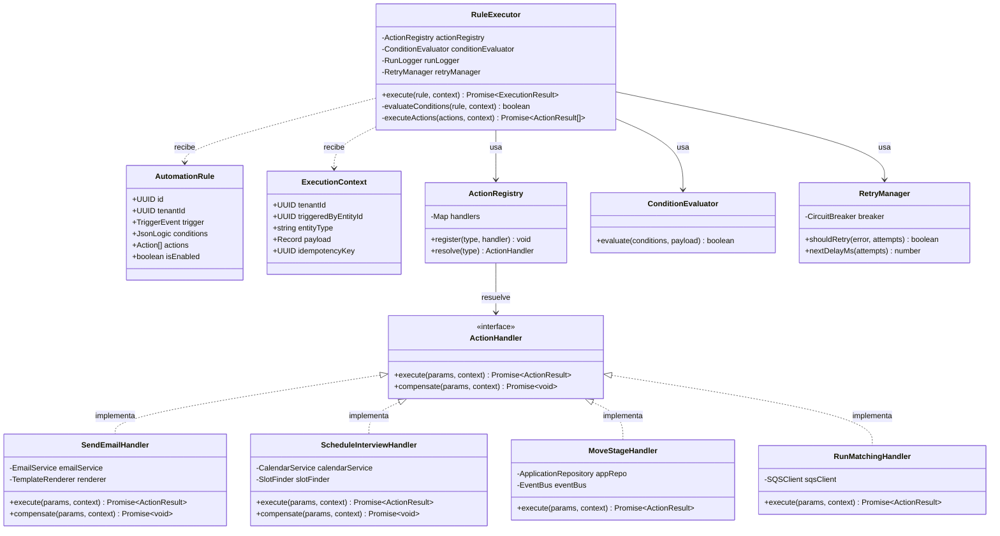
```mermaid
classDiagram
    class RuleExecutor {
        -ActionRegistry actionRegistry
        -ConditionEvaluator conditionEvaluator
        -RunLogger runLogger
        -RetryManager retryManager
        +execute(rule, context) Promise~ExecutionResult~
        -evaluateConditions(rule, context) boolean
        -executeActions(actions, context) Promise~ActionResult[]~
    }

    class AutomationRule {
        +UUID id
        +UUID tenantId
        +TriggerEvent trigger
        +JsonLogic conditions
        +Action[] actions
        +boolean isEnabled
    }

    class ExecutionContext {
        +UUID tenantId
        +UUID triggeredByEntityId
        +string entityType
        +Record payload
        +UUID idempotencyKey
    }

    class ActionRegistry {
        -Map handlers
        +register(type, handler) void
        +resolve(type) ActionHandler
    }

    class ActionHandler {
        <<interface>>
        +execute(params, context) Promise~ActionResult~
        +compensate(params, context) Promise~void~
    }

    class SendEmailHandler {
        -EmailService emailService
        -TemplateRenderer renderer
        +execute(params, context) Promise~ActionResult~
        +compensate(params, context) Promise~void~
    }

    class ScheduleInterviewHandler {
        -CalendarService calendarService
        -SlotFinder slotFinder
        +execute(params, context) Promise~ActionResult~
        +compensate(params, context) Promise~void~
    }

    class MoveStageHandler {
        -ApplicationRepository appRepo
        -EventBus eventBus
        +execute(params, context) Promise~ActionResult~
    }

    class RunMatchingHandler {
        -SQSClient sqsClient
        +execute(params, context) Promise~ActionResult~
    }

    class ConditionEvaluator {
        +evaluate(conditions, payload) boolean
    }

    class RetryManager {
        -CircuitBreaker breaker
        +shouldRetry(error, attempts) boolean
        +nextDelayMs(attempts) number
    }

    RuleExecutor --> ActionRegistry : usa
    RuleExecutor --> ConditionEvaluator : usa
    RuleExecutor --> RetryManager : usa
    ActionRegistry --> ActionHandler : resuelve
    ActionHandler <|.. SendEmailHandler : implementa
    ActionHandler <|.. ScheduleInterviewHandler : implementa
    ActionHandler <|.. MoveStageHandler : implementa
    ActionHandler <|.. RunMatchingHandler : implementa
    RuleExecutor ..> AutomationRule : recibe
    RuleExecutor ..> ExecutionContext : recibe
```

---

## 8. Diagramas de infraestructura y despliegue

### 8.1 Topología AWS general

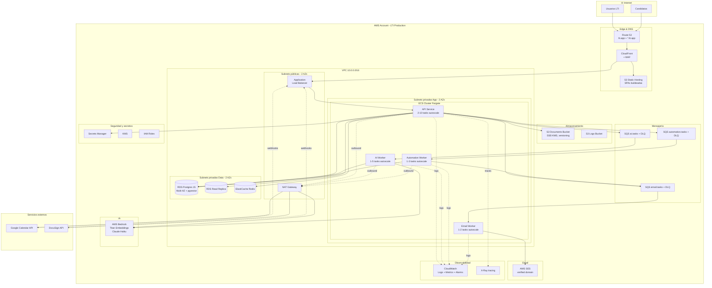
```mermaid
flowchart TB
    subgraph Internet["🌐 Internet"]
        USERS[Usuarios LTI]
        CANDS[Candidatos]
    end

    subgraph AWSAccount["AWS Account - LTI Production"]
        subgraph Edge["Edge & DNS"]
            R53[Route 53<br/>lti.app + *.lti.app]
            CF[CloudFront<br/>+ WAF]
            S3STATIC[S3 Static Hosting<br/>SPAs buildeadas]
        end

        subgraph VPC["VPC 10.0.0.0/16"]
            subgraph PublicSubnets["Subnets públicas - 2 AZs"]
                ALB[Application<br/>Load Balancer]
                NAT[NAT Gateway]
            end

            subgraph PrivateAppSubnets["Subnets privadas App - 2 AZs"]
                subgraph ECSCluster["ECS Cluster Fargate"]
                    APITASK[API Service<br/>2-10 tasks autoscale]
                    AITASK[AI Worker<br/>1-5 tasks autoscale]
                    AUTOTASK[Automation Worker<br/>1-3 tasks autoscale]
                    EMAILTASK[Email Worker<br/>1-2 tasks autoscale]
                end
            end

            subgraph PrivateDataSubnets["Subnets privadas Data - 2 AZs"]
                RDS[(RDS Postgres 15<br/>Multi-AZ + pgvector)]
                RDSREAD[(RDS Read Replica)]
                ELASTICACHE[(ElastiCache Redis)]
            end
        end

        subgraph Storage["Almacenamiento"]
            S3DOCS[S3 Documents Bucket<br/>SSE-KMS, versioning]
            S3LOGS[S3 Logs Bucket]
        end

        subgraph Messaging["Mensajería"]
            SQSAI[SQS ai.tasks + DLQ]
            SQSAUTO[SQS automation.tasks + DLQ]
            SQSEMAIL[SQS email.tasks + DLQ]
        end

        subgraph AIInfra["IA"]
            BEDROCK[AWS Bedrock<br/>Titan Embeddings<br/>Claude Haiku]
        end

        subgraph EmailInfra["Email"]
            SES[AWS SES<br/>verified domain]
        end

        subgraph Security["Seguridad y secretos"]
            SM[Secrets Manager]
            KMS[KMS]
            IAM[IAM Roles]
        end

        subgraph Observability["Observabilidad"]
            CW[CloudWatch<br/>Logs + Metrics + Alarms]
            XRAY[X-Ray tracing]
        end
    end

    subgraph External["Servicios externos"]
        GCAL[Google Calendar API]
        DOCU[DocuSign API]
    end

    USERS & CANDS --> R53
    R53 --> CF
    CF --> S3STATIC
    CF --> ALB

    ALB --> APITASK

    APITASK --> RDS
    APITASK --> RDSREAD
    APITASK --> ELASTICACHE
    APITASK --> S3DOCS
    APITASK --> SQSAI & SQSAUTO & SQSEMAIL
    APITASK --> SM

    SQSAI --> AITASK
    SQSAUTO --> AUTOTASK
    SQSEMAIL --> EMAILTASK

    AITASK --> BEDROCK
    AITASK --> RDS
    AUTOTASK --> RDS
    AUTOTASK --> SQSEMAIL
    EMAILTASK --> SES

    APITASK & AITASK & AUTOTASK -.outbound.-> NAT
    NAT --> GCAL & DOCU & BEDROCK

    APITASK & AITASK & AUTOTASK & EMAILTASK -.logs.-> CW
    APITASK -.traces.-> XRAY

    DOCU -.webhooks.-> ALB
    GCAL -.webhooks.-> ALB
```

### 8.2 Diagrama de despliegue (Deployment Diagram - C4 estilo)

Mapeo de containers lógicos a nodos físicos / runtime de despliegue.

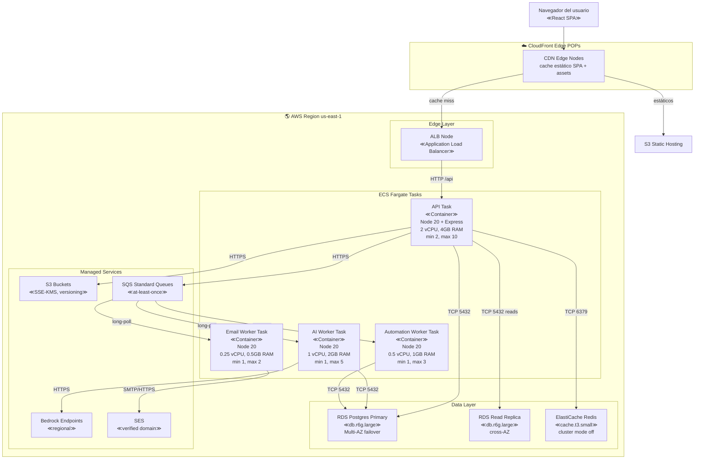
```mermaid
flowchart TB
    subgraph CDN["☁️ CloudFront Edge POPs"]
        CFEDGE[CDN Edge Nodes<br/>cache estático SPA + assets]
    end

    subgraph Region["🌎 AWS Region us-east-1"]
        subgraph EdgeLayer["Edge Layer"]
            ALBNODE["ALB Node<br/>≪Application Load Balancer≫"]
        end

        subgraph FargateNodes["ECS Fargate Tasks"]
            APIINST["API Task<br/>≪Container≫<br/>Node 20 + Express<br/>2 vCPU, 4GB RAM<br/>min 2, max 10"]
            AIINST["AI Worker Task<br/>≪Container≫<br/>Node 20<br/>1 vCPU, 2GB RAM<br/>min 1, max 5"]
            AUTOINST["Automation Worker Task<br/>≪Container≫<br/>Node 20<br/>0.5 vCPU, 1GB RAM<br/>min 1, max 3"]
            EMAILINST["Email Worker Task<br/>≪Container≫<br/>Node 20<br/>0.25 vCPU, 0.5GB RAM<br/>min 1, max 2"]
        end

        subgraph DataLayer["Data Layer"]
            RDSNODE["RDS Postgres Primary<br/>≪db.r6g.large≫<br/>Multi-AZ failover"]
            RDSREADNODE["RDS Read Replica<br/>≪db.r6g.large≫<br/>cross-AZ"]
            REDISNODE["ElastiCache Redis<br/>≪cache.t3.small≫<br/>cluster mode off"]
        end

        subgraph ManagedSvcs["Managed Services"]
            S3NODE["S3 Buckets<br/>≪SSE-KMS, versioning≫"]
            SQSNODE["SQS Standard Queues<br/>≪at-least-once≫"]
            BEDROCKNODE["Bedrock Endpoints<br/>≪regional≫"]
            SESNODE["SES<br/>≪verified domain≫"]
        end
    end

    BROWSER["Navegador del usuario<br/>≪React SPA≫"] --> CFEDGE
    CFEDGE -->|cache miss| ALBNODE
    CFEDGE -->|estáticos| S3STATIC2["S3 Static Hosting"]

    ALBNODE -->|HTTP /api| APIINST

    APIINST -->|TCP 5432| RDSNODE
    APIINST -->|TCP 5432 reads| RDSREADNODE
    APIINST -->|TCP 6379| REDISNODE
    APIINST -->|HTTPS| S3NODE
    APIINST -->|HTTPS| SQSNODE

    SQSNODE -->|long-poll| AIINST
    SQSNODE -->|long-poll| AUTOINST
    SQSNODE -->|long-poll| EMAILINST

    AIINST -->|HTTPS| BEDROCKNODE
    AIINST -->|TCP 5432| RDSNODE
    AUTOINST -->|TCP 5432| RDSNODE
    EMAILINST -->|SMTP/HTTPS| SESNODE
```

### 8.3 Notas de la infraestructura

- **Multi-AZ** en RDS y ALB para alta disponibilidad. ECS tasks distribuidas en 2 AZs.
- **Read replica** de RDS para queries de reportería pesada (ver sección 12).
- **Autoscaling** en ECS basado en CPU >70% y profundidad de cola SQS.
- **Backups RDS**: automated daily + retención 30 días.
- **Secrets**: nada hardcodeado. JWT secret, DB password, OAuth client secrets, etc., en Secrets Manager.
- **Encryption**:
  - In transit: TLS 1.2+ en todos los links.
  - At rest: RDS con KMS, S3 SSE-KMS, ElastiCache encryption.
- **WAF rules**: rate limiting por IP, OWASP Top 10 managed rules.
- **Costo estimado MVP** (50 tenants, 5 users promedio): ~USD 1.500-2.500/mes en AWS.

---

## 9. Diagramas de flujo y secuencia

### 9.1 Secuencia — Aplicación de candidato con matching IA

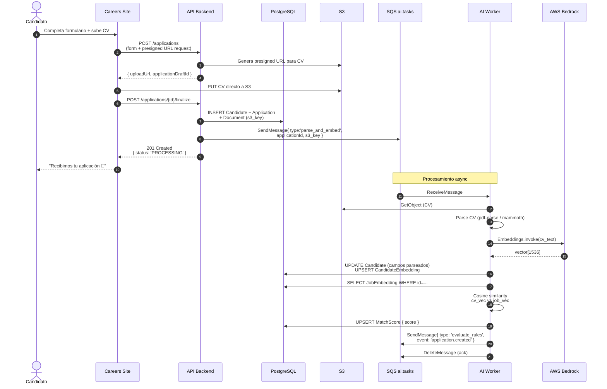
```mermaid
sequenceDiagram
    autonumber
    actor Cand as Candidato
    participant CP as Careers Site
    participant API as API Backend
    participant PG as PostgreSQL
    participant S3 as S3
    participant SQS as SQS ai.tasks
    participant AIW as AI Worker
    participant BR as AWS Bedrock

    Cand->>CP: Completa formulario + sube CV
    CP->>API: POST /applications<br/>(form + presigned URL request)
    API->>S3: Genera presigned URL para CV
    API-->>CP: { uploadUrl, applicationDraftId }
    CP->>S3: PUT CV directo a S3
    CP->>API: POST /applications/{id}/finalize
    API->>PG: INSERT Candidate + Application<br/>+ Document (s3_key)
    API->>SQS: SendMessage{ type:'parse_and_embed',<br/>applicationId, s3_key }
    API-->>CP: 201 Created<br/>{ status: 'PROCESSING' }
    CP-->>Cand: "Recibimos tu aplicación 🎉"

    Note over SQS,AIW: Procesamiento async

    SQS->>AIW: ReceiveMessage
    AIW->>S3: GetObject (CV)
    AIW->>AIW: Parse CV (pdf-parse / mammoth)
    AIW->>BR: Embeddings.invoke(cv_text)
    BR-->>AIW: vector[1536]
    AIW->>PG: UPDATE Candidate (campos parseados)<br/>UPSERT CandidateEmbedding
    AIW->>PG: SELECT JobEmbedding WHERE id=...
    AIW->>AIW: Cosine similarity<br/>cv_vec vs job_vec
    AIW->>PG: UPSERT MatchScore { score }
    AIW->>SQS: SendMessage{ type: 'evaluate_rules',<br/>event: 'application.created' }
    AIW->>SQS: DeleteMessage (ack)
```

### 9.2 Secuencia — Auto-scheduling de entrevista

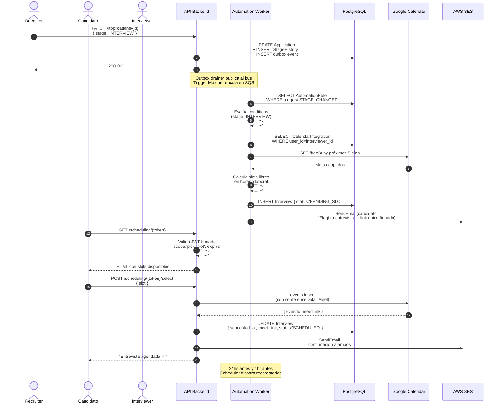
```mermaid
sequenceDiagram
    autonumber
    actor Rec as Recruiter
    actor Cand as Candidato
    actor Iv as Interviewer
    participant API as API Backend
    participant Auto as Automation Worker
    participant PG as PostgreSQL
    participant GC as Google Calendar
    participant SES as AWS SES

    Rec->>API: PATCH /applications/{id}<br/>{ stage: 'INTERVIEW' }
    API->>PG: UPDATE Application<br/>+ INSERT StageHistory<br/>+ INSERT outbox event
    API-->>Rec: 200 OK

    Note over API,Auto: Outbox drainer publica al bus<br/>Trigger Matcher encola en SQS

    Auto->>PG: SELECT AutomationRule<br/>WHERE trigger='STAGE_CHANGED'
    Auto->>Auto: Evalúa conditions<br/>(stage=INTERVIEW)
    Auto->>PG: SELECT CalendarIntegration<br/>WHERE user_id=interviewer_id

    Auto->>GC: GET /freeBusy próximos 5 días
    GC-->>Auto: slots ocupados
    Auto->>Auto: Calcula slots libres<br/>en horario laboral
    Auto->>PG: INSERT Interview { status:'PENDING_SLOT' }
    Auto->>SES: SendEmail(candidato,<br/>"Elegí tu entrevista" + link único firmado)

    Cand->>API: GET /scheduling/{token}
    API->>API: Valida JWT firmado<br/>scope:'pick_slot', exp:7d
    API-->>Cand: HTML con slots disponibles
    Cand->>API: POST /scheduling/{token}/select<br/>{ slot }

    API->>GC: events.insert<br/>(con conferenceData=Meet)
    GC-->>API: { eventId, meetLink }
    API->>PG: UPDATE Interview<br/>{ scheduled_at, meet_link, status:'SCHEDULED' }

    API->>SES: SendEmail<br/>confirmación a ambos
    API-->>Cand: "Entrevista agendada ✓"

    Note over Auto: 24hs antes y 1hr antes<br/>Scheduler dispara recordatorios
```

### 9.3 Flujo — Cierre de vacante (oferta + onboarding)

```mermaid
flowchart TB
    START([Candidato en etapa 'Offer']) --> GEN[Recruiter genera<br/>carta oferta desde plantilla]
    GEN --> APPROVE{Hiring Manager<br/>aprueba?}
    APPROVE -->|No| REVISE[Revisar con HM<br/>+ ajustar]
    REVISE --> APPROVE
    APPROVE -->|Sí| SEND[LTI envía sobre<br/>a DocuSign API]
    SEND --> WAIT[Estado: SENT<br/>Esperando firma]

    WAIT --> SIGNED{Candidato<br/>firma?}
    SIGNED -->|Rechaza| REJ[Estado: REJECTED<br/>Notificar recruiter]
    SIGNED -->|Expira 7 días| EXP[Estado: EXPIRED<br/>Re-emitir o cerrar]
    SIGNED -->|Sí| WEBHOOK[DocuSign webhook<br/>API valida HMAC]

    WEBHOOK --> AUTO[Automation Worker<br/>dispara on offer.signed]
    AUTO --> A1[Cerrar Application:<br/>status=HIRED]
    AUTO --> A2[Cerrar Job:<br/>status=CLOSED]
    AUTO --> A3[Crear Employee record]
    AUTO --> A4[Generar OnboardingTasks<br/>desde plantilla]
    AUTO --> A5[Email de welcome<br/>+ acceso Onboarding Portal]

    A3 & A4 & A5 --> ONBSTART([Inicio Onboarding])

    ONBSTART --> CHECK[Empleado completa<br/>checklist pre-primer-día]
    CHECK --> COMPLETE{Todas las<br/>tareas done?}
    COMPLETE -->|No| REMIND[Recordatorios<br/>automáticos cada 3 días]
    REMIND --> CHECK
    COMPLETE -->|Sí| READY([✅ Empleado listo<br/>para Day 1])

    REJ --> POOL[Mover candidato<br/>a Talent Pool con tag]
    EXP --> POOL
```

### 9.4 State machine — Lifecycle del candidato

```mermaid
stateDiagram-v2
    [*] --> Applied: Aplicación recibida

    Applied --> Screening: Recruiter selecciona
    Applied --> Rejected: Match score bajo<br/>+ auto-reject habilitado
    Applied --> Withdrawn: Candidato retira

    Screening --> Interview: Aprueba pre-call
    Screening --> Rejected: No avanza
    Screening --> Withdrawn

    Interview --> Interview: Múltiples rondas
    Interview --> OfferStage: Scorecard positivo
    Interview --> Rejected: Scorecard negativo
    Interview --> Withdrawn

    OfferStage --> Offered: Oferta enviada
    Offered --> Hired: Firma aceptada
    Offered --> Rejected: Candidato rechaza
    Offered --> Expired: 7 días sin respuesta

    Hired --> Onboarding: Employee creado
    Onboarding --> Active: Day 1 completado

    Rejected --> TalentPool: Auto-añadido al pool
    Withdrawn --> TalentPool
    Expired --> TalentPool

    TalentPool --> Applied: Re-aplicación a<br/>otra vacante

    Active --> [*]
```

### 9.5 Secuencia — Generación de descripción de vacante con IA

```mermaid
sequenceDiagram
    autonumber
    actor Rec as Recruiter
    participant SPA as Web SPA
    participant API as API Backend
    participant SQS as SQS ai.tasks
    participant AIW as AI Worker
    participant BR as AWS Bedrock<br/>(Claude Haiku)
    participant PG as PostgreSQL

    Rec->>SPA: Click "Generar con IA"<br/>+ form corto<br/>(rol, seniority, skills)
    SPA->>API: POST /jobs/draft/generate-description
    API->>PG: INSERT Job { status: 'DRAFT' }
    API->>SQS: SendMessage{ type:'generate_jd',<br/>jobId, prompt_inputs }
    API-->>SPA: 202 Accepted<br/>{ jobId, status: 'GENERATING' }
    SPA->>SPA: Mostrar loading<br/>+ poll cada 2s

    SQS->>AIW: ReceiveMessage
    AIW->>AIW: Construye prompt<br/>(template + inputs)
    AIW->>BR: invoke(messages, model=Claude Haiku)
    BR-->>AIW: descripción generada
    AIW->>BR: Embeddings.invoke(jd_text)
    BR-->>AIW: vector[1536]
    AIW->>PG: UPDATE Job + UPSERT JobEmbedding<br/>{ status:'DRAFT_READY' }
    AIW->>SQS: DeleteMessage

    SPA->>API: GET /jobs/{id} (poll)
    API->>PG: SELECT Job
    API-->>SPA: { description, status: 'DRAFT_READY' }
    SPA-->>Rec: Muestra draft editable
    Rec->>SPA: Ajusta y publica
    SPA->>API: PATCH /jobs/{id}<br/>{ status: 'PUBLISHED' }
```

### 9.6 Flujo — Aislamiento multi-tenant en cada request

```mermaid
flowchart TB
    REQ[HTTP Request<br/>+ JWT en header] --> AUTH[Auth Middleware<br/>verifica JWT]
    AUTH --> EXTRACT[Extrae claims:<br/>userId, tenantId, roles]
    EXTRACT --> CTX[AsyncLocalStorage<br/>setea TenantContext]
    CTX --> RBAC[RBAC Middleware<br/>verifica role vs ruta]
    RBAC --> CTRL[Controller / Service]
    CTRL --> PRISMA[Prisma Client<br/>middleware tenantFilter]
    PRISMA --> CHECK{Query incluye<br/>tenantId?}
    CHECK -->|No tiene where| INJECT[Inyecta<br/>where: tenantId from CTX]
    CHECK -->|Sí tiene where| VERIFY[Verifica que<br/>tenantId coincida con CTX]
    VERIFY --> EXEC[Ejecuta query]
    INJECT --> EXEC
    EXEC --> DB[(PostgreSQL)]
    DB --> RES[Response]

    VERIFY -.tenantId mismatch.-> ERR[Throw TenantMismatchError<br/>HTTP 403 + alerta seguridad]
```

---

## 10. Seguridad y compliance

Para un ATS, la seguridad y el cumplimiento de protección de datos personales no son opcionales: manejamos PII (datos personales), historial laboral, datos de contacto, y en algunos casos información sensible (foto, DNI durante onboarding). Esta sección documenta cómo LTI cumple con la **Ley 25.326 de Protección de Datos Personales de Argentina** y aplica buenas prácticas de seguridad estándar.

### 10.1 Matriz RBAC (Role-Based Access Control)

LTI define 6 roles fijos en MVP. La siguiente matriz muestra qué puede hacer cada rol sobre las entidades principales.

| Acción \ Rol | Super Admin | Recruiter | Hiring Manager | Interviewer | Employee | Candidate |
|---|:---:|:---:|:---:|:---:|:---:|:---:|
| **Tenant** | | | | | | |
| Configurar tenant, usuarios, plantillas | ✅ | ❌ | ❌ | ❌ | ❌ | ❌ |
| Configurar AutomationRules | ✅ | ✅ | ❌ | ❌ | ❌ | ❌ |
| Ver billing | ✅ | ❌ | ❌ | ❌ | ❌ | ❌ |
| **Vacantes** | | | | | | |
| Crear vacante | ✅ | ✅ | ✅(solicitar) | ❌ | ❌ | ❌ |
| Aprobar vacante | ✅ | ❌ | ✅ | ❌ | ❌ | ❌ |
| Publicar vacante | ✅ | ✅ | ❌ | ❌ | ❌ | ❌ |
| Ver vacantes propias | ✅ | ✅ | ✅(las suyas) | ❌ | ❌ | ✅(públicas) |
| **Candidatos** | | | | | | |
| Ver pipeline completo de vacante | ✅ | ✅ | ✅(las suyas) | ❌ | ❌ | ❌ |
| Ver candidato individual | ✅ | ✅ | ✅(de sus vacantes) | ✅(asignados) | ❌ | ✅(self) |
| Mover candidato de etapa | ✅ | ✅ | ✅(las suyas) | ❌ | ❌ | ❌ |
| Rechazar candidato | ✅ | ✅ | ✅(las suyas) | ❌ | ❌ | ❌ |
| Importar al talent pool | ✅ | ✅ | ❌ | ❌ | ❌ | ❌ |
| **Entrevistas** | | | | | | |
| Agendar entrevista | ✅ | ✅ | ❌ | ❌ | ❌ | ✅(slot único) |
| Completar scorecard | ✅ | ✅ | ✅ | ✅ | ❌ | ❌ |
| **Ofertas** | | | | | | |
| Generar oferta | ✅ | ✅ | ❌ | ❌ | ❌ | ❌ |
| Aprobar oferta | ✅ | ❌ | ✅ | ❌ | ❌ | ❌ |
| **Onboarding** | | | | | | |
| Ver checklist de empleado | ✅ | ✅ | ✅(de sus contrataciones) | ❌ | ✅(self) | ❌ |
| Marcar tarea como completada | ✅ | ✅ | ❌ | ❌ | ✅(self) | ❌ |
| **Reportes** | | | | | | |
| Ver dashboards globales | ✅ | ✅ | ❌ | ❌ | ❌ | ❌ |
| Ver dashboards de sus vacantes | ✅ | ✅ | ✅ | ❌ | ❌ | ❌ |

**Notas de implementación**:
- RBAC se chequea en middleware Express antes de llegar al controller.
- Hiring Manager solo puede ver sus vacantes asignadas (`JOB.hiring_manager_id = userId`).
- Interviewer solo puede ver candidatos de entrevistas a las que fue asignado.
- Candidato accede a su propia info vía **token único firmado** con scope limitado (no JWT general).

### 10.2 Modelo de autenticación

#### 10.2.1 Usuarios internos del tenant

- **Esquema**: JWT propio sobre Express.
- **Access token**: JWT firmado con HS256, expira en 15 minutos. Claims: `{ sub: userId, tenantId, roles, exp, iat }`.
- **Refresh token**: opaque token persistido en Redis con TTL 30 días. Permite rotación.
- **Rotación**: cada vez que se usa un refresh token, se invalida el anterior y se emite uno nuevo (refresh token rotation).
- **Revocación**: lista de revocación en Redis (para logout/desactivación de usuario).
- **Password storage**: bcrypt con cost factor 12.
- **Password policy**: mínimo 12 caracteres, al menos 1 mayúscula, 1 número, 1 símbolo. Rate limit en login (5 intentos / 15min).

#### 10.2.2 Candidatos accediendo a portales públicos

- No tienen cuenta tradicional.
- Acceso vía **token único firmado** (JWT corto):
  - Para elegir slot de entrevista: scope `pick_slot`, expira en 7 días, vinculado a `interview_id`.
  - Para ver estado de aplicación: scope `view_application`, expira en 30 días.
  - Para completar onboarding: scope `onboarding`, expira en `hire_date + 30 días`.

### 10.3 Manejo de PII y compliance Ley 25.326

#### 10.3.1 Identificación de campos PII

| Campo | Categoría | Tratamiento |
|---|---|---|
| `CANDIDATE.email`, `phone`, `linkedin_url` | PII estándar | Encriptado at-rest (KMS), TLS en tránsito |
| `CANDIDATE.first_name`, `last_name` | PII estándar | Encriptado at-rest |
| `EMPLOYEE.email`, datos bancarios (en `Document`) | PII sensible | Encriptado at-rest, acceso solo Super Admin + audit log |
| Documentos en S3 (CV, DNI, etc.) | PII sensible | SSE-KMS, presigned URLs con expiración corta (5 min) |
| `CALENDAR_INTEGRATION.oauth_refresh_token` | Secreto | Encriptado con KMS, nunca devuelto al cliente |
| `USER.password_hash` | Secreto | bcrypt, nunca devuelto |

#### 10.3.2 Cumplimiento Ley 25.326

La Ley 25.326 de Argentina exige:

| Exigencia | Implementación en LTI |
|---|---|
| **Consentimiento explícito** del titular | El candidato acepta política de privacidad al aplicar (checkbox obligatorio + texto legible). Versión de la política aceptada queda registrada con timestamp. |
| **Finalidad informada** del tratamiento de datos | Política de privacidad declara: evaluación para vacantes presentes y futuras, comunicaciones relacionadas, retención por X meses. |
| **Derecho de acceso** | Candidato puede solicitar export de sus datos vía email a `privacy@lti.app`. Endpoint admin permite generar JSON con todos los datos del candidato en <48hs. |
| **Derecho de rectificación** | Candidato puede solicitar corrección. El recruiter del tenant ejecuta. |
| **Derecho de eliminación (olvido)** | Candidato puede solicitar borrado. Endpoint admin ejecuta hard-delete de Candidate, Applications, Documents, Embeddings. **Excepción**: datos de empleados activos no se borran por exigencia laboral. |
| **Plazo de retención** | CVs de candidatos rechazados: 24 meses (default tenant, configurable). Después → job de purga automática mensual. Empleados: indefinido mientras dure relación + 10 años después (Ley de Contrato de Trabajo). |
| **Registro como base de datos en AAIP** | Es responsabilidad del **tenant** (cliente de LTI), no de LTI. Documentado en términos de servicio. LTI provee la herramienta; el tenant es el responsable del tratamiento. |
| **Transferencia internacional** | Datos hosteados en AWS us-east-1 (Virginia, USA). Política informa al titular. AWS tiene cláusulas de transferencia internacional adecuadas. |
| **Medidas de seguridad** | Encriptación at-rest y in-transit, RBAC, audit logs, backups, plan de respuesta a incidentes (ver 10.5). |

#### 10.3.3 Rol de LTI vs el tenant

- **Tenant (cliente de LTI)**: Responsable del tratamiento de datos personales. Define finalidades, retención, atiende solicitudes de titulares.
- **LTI (Anthropic-style)**: Encargado del tratamiento. Provee infra, herramientas, ejecuta operaciones por instrucción del tenant. Firma DPA (Data Processing Agreement) con cada tenant en el onboarding.

### 10.4 Otras medidas de seguridad

- **OWASP Top 10 mitigations**: validación de inputs (Zod), prepared statements (Prisma), CSP headers, rate limiting (Redis), CSRF tokens en operaciones state-changing.
- **Webhooks externos**: validación de firma HMAC (DocuSign signs requests; Google Calendar usa channel tokens).
- **Audit log**: tabla `audit_log` (omitida del DER por concisión) registra: login, password changes, cambios de role, accesos a PII sensible, exports de datos, eliminaciones.
- **Network**: tasks de ECS en subnets privadas; outbound solo vía NAT; security groups restrictivos.
- **Dependencias**: scanning continuo con `npm audit` + Snyk en CI. Renovate bot para PRs de actualización.
- **Penetration testing**: anual con vendor externo. Bug bounty program a partir de v1.1.

### 10.5 Plan de respuesta a incidentes (resumen)

1. **Detección**: alertas CloudWatch (errores 5xx anómalos, accesos cross-tenant, picos de fallos de auth).
2. **Triage**: on-call ingeniero clasifica severidad (P0/P1/P2/P3).
3. **Contención**: rotación de credenciales si aplica, bloqueo de IPs/usuarios, deshabilitación de feature.
4. **Notificación**: si es brecha de datos PII, notificación al tenant en <24hs y a la AAIP según ley.
5. **Postmortem**: blameless, con plan de prevención.

---

## 11. Atributos de calidad y SLAs

### 11.1 Disponibilidad

| Componente | Objetivo MVP | Mecanismo |
|---|---|---|
| **API Backend** | 99.5% (≈ 3.6 hs downtime/mes) | Multi-AZ, autoscaling, health checks, blue/green deploys |
| **Web SPA / Careers Site** | 99.9% (≈ 43 min/mes) | CloudFront + S3 (alta disponibilidad nativa) |
| **Workers async** | 99.0% | SQS retiene mensajes hasta 14 días; reintento automático |
| **PostgreSQL** | 99.95% (≈ 22 min/mes) | RDS Multi-AZ con failover automático |

**Mantenimientos planificados**: ventana mensual sábado 4:00-6:00 AM ART, comunicada con 7 días de anticipación.

### 11.2 Performance / Latencia

| Endpoint / Operación | Target P50 | Target P95 | Target P99 |
|---|---|---|---|
| `GET /jobs` (listado paginado) | <100ms | <300ms | <600ms |
| `GET /applications/{id}` | <80ms | <250ms | <500ms |
| `POST /applications` (crear) | <200ms | <600ms | <1.2s |
| Pipeline render (drag-and-drop) | <150ms | <400ms | <800ms |
| Búsqueda semántica de candidatos | <300ms | <800ms | <1.5s |
| Generación IA de descripción | <8s | <15s | <30s |
| Auto-scheduling (cálculo de slots) | <500ms | <1.5s | <3s |

**Mediciones**: percentiles de latencia capturados con CloudWatch Embedded Metric Format desde el API. Dashboards y alertas configuradas.

### 11.3 Escalabilidad

| Dimensión | Target MVP | Estrategia |
|---|---|---|
| **Tenants concurrentes** | 500 | Multi-tenancy shared-DB; sin cambios de arquitectura hasta 2.000 tenants. |
| **Usuarios activos simultáneos** | 2.000 | API horizontal scale ECS; Redis para sessions. |
| **Aplicaciones / segundo (peak)** | 50 RPS | API + SQS para procesamiento async. |
| **Candidatos por tenant** | 100.000 | pgvector con IVFFlat rinde bien. Más allá → considerar OpenSearch. |
| **Embeddings totales** | 5M | pgvector. Si se supera, evaluar particionado o vector DB dedicada. |

**Trigger de re-arquitectura**: si superamos 1.000 tenants activos o 50K aplicaciones diarias, evaluar extracción de Recruitment Module a microservicio independiente.

### 11.4 RTO / RPO

| Métrica | Target | Mecanismo |
|---|---|---|
| **RTO (Recovery Time Objective)** | <4 hs | Failover RDS Multi-AZ (<2 min); ECS rebalance automático; runbooks documentados. |
| **RPO (Recovery Point Objective)** | <15 min | RDS automated backups + point-in-time recovery con WAL retention de 7 días. S3 con versioning. |
| **Backup retention** | 30 días | RDS automated backups + snapshot manual mensual a S3 con retención 1 año. |
| **DR testing** | Trimestral | Restauración de snapshot a entorno aislado y validación. |

### 11.5 Otros atributos

- **Mantenibilidad**: cobertura de tests >70% en módulos críticos (Auth, Recruitment, Workflow Engine). Linting estricto. Code review obligatorio.
- **Observabilidad**: structured logging (JSON), correlation IDs, distributed tracing con X-Ray, métricas custom de negocio (vacantes activas, applications/día, latencia IA).
- **Compatibilidad**: navegadores soportados — Chrome, Firefox, Edge, Safari últimas 2 versiones. No IE.
- **Accesibilidad**: portales públicos (Careers Site, Candidate Portal) cumplen WCAG 2.1 nivel AA.
- **i18n-ready**: arquitectura preparada con `i18next`, español como único idioma activo en MVP; extensible a portugués e inglés sin refactor.

---

## 12. Estrategia de reportes y analytics

### 12.1 Requerimiento

LTI necesita servir 5 dashboards must-have del MVP:

1. Embudo por vacante (etapa por etapa con conversion rates).
2. Time-to-hire promedio (global, por reclutador, por tipo de rol).
3. Source effectiveness (LinkedIn vs Careers Site vs Referidos).
4. Carga de trabajo por reclutador.
5. Vacantes en riesgo (>30 días abiertas sin avance).

### 12.2 Decisión arquitectural: read replica + materialized views

Para MVP **no construimos un data warehouse separado** (Redshift, Snowflake) por costo y simplicidad. Las queries de reportería corren sobre una **read replica de RDS Postgres** + **materialized views** refrescadas periódicamente.

```mermaid
flowchart LR
    APIPRIMARY[API Backend] -->|writes + reads transaccionales| RDSPRIMARY[(RDS Primary)]
    APIREPORTS[Reporting Module] -->|reads de reportes| RDSREAD[(RDS Read Replica)]
    RDSPRIMARY -.streaming replication.-> RDSREAD

    subgraph MaterializedViews["Materialized Views en Read Replica"]
        MV1[mv_funnel_by_job<br/>refresh cada 15 min]
        MV2[mv_time_to_hire<br/>refresh cada 1 hr]
        MV3[mv_source_effectiveness<br/>refresh cada 1 hr]
        MV4[mv_recruiter_workload<br/>refresh cada 5 min]
        MV5[mv_jobs_at_risk<br/>refresh cada 30 min]
    end

    RDSREAD --- MaterializedViews
    APIREPORTS --> MaterializedViews
```

### 12.3 Detalle de cada métrica

| Dashboard | Materialized view | Cómputo | Refresh |
|---|---|---|---|
| **Embudo por vacante** | `mv_funnel_by_job` | Por `job_id` y `pipeline_stage_id`: `count(applications)` agrupado. Conversion rate = etapa N+1 / etapa N. | 15 min |
| **Time-to-hire** | `mv_time_to_hire` | Por `application` con status='HIRED': `signed_at - applied_at`. Promedio global, por recruiter, por job. | 1 hr |
| **Source effectiveness** | `mv_source_effectiveness` | Por `candidate.source`: count applications, count hires, ratio. | 1 hr |
| **Carga de trabajo** | `mv_recruiter_workload` | Por `recruiter_id`: count vacantes activas, count candidatos en pipeline, count entrevistas próximas 7 días. | 5 min |
| **Vacantes en riesgo** | `mv_jobs_at_risk` | Jobs con `published_at < now() - 30 days` AND `status='PUBLISHED'` AND última `stage_change` > 7 días. | 30 min |

### 12.4 Refresh de materialized views

- **Mecanismo**: scheduler en API con `pg_advisory_lock` ejecuta `REFRESH MATERIALIZED VIEW CONCURRENTLY` por view según su frecuencia.
- **Concurrente**: `CONCURRENTLY` permite reads continuos durante el refresh.
- **Incrementalidad futura**: si en v1.2 las views crecen mucho, evaluar pasar a tablas regulares con triggers o usar Citus / TimescaleDB.

### 12.5 Cuándo migrar a Data Warehouse

Triggers que justifican mover analytics a un DW dedicado (Redshift / Snowflake / BigQuery):
- Reportes cross-tenant (analytics interno de LTI sobre todos los tenants) — necesario desde Año 2.
- Cohort analysis avanzado.
- Integraciones con BI tools de los clientes (Looker, Power BI).
- Volumen >50M de aplicaciones acumuladas.

---

## 13. Estrategia de testing

### 13.1 Pirámide de testing

```mermaid
flowchart TB
    subgraph Pyramid["Pirámide de Testing - LTI"]
        E2E["🔺 E2E Tests<br/>Playwright<br/>~30 tests<br/>Flujos críticos completos"]
        INT["🔶 Integration Tests<br/>Jest + Testcontainers<br/>~150 tests<br/>API + DB + servicios mock"]
        CONTRACT["🟦 Contract Tests<br/>Pact / Zod schemas<br/>~80 contratos<br/>Entre módulos del monolito y workers"]
        UNIT["🟩 Unit Tests<br/>Jest<br/>~600+ tests<br/>Lógica de dominio pura"]
    end

    UNIT --> CONTRACT
    CONTRACT --> INT
    INT --> E2E
```

### 13.2 Detalle por capa

| Capa | Herramienta | Cobertura objetivo | Qué testea |
|---|---|---|---|
| **Unit** | Jest | >80% en `services/` y `domain/` | Lógica pura: validaciones, cálculos, transformaciones, condition evaluator, slot finder. |
| **Contract** | Zod schemas + Pact | 100% de eventos del Event Bus | Esquemas de eventos, payloads de SQS, contratos entre módulos. Evita que cambios en un módulo rompan a otro. |
| **Integration** | Jest + Testcontainers (Postgres real) | >70% de endpoints | API + DB real + servicios externos mockeados. Tenant isolation, RBAC, transacciones, outbox. |
| **E2E** | Playwright | Flujos críticos | Aplicación de candidato, auto-scheduling, firma de oferta, onboarding. |

### 13.3 Testing de IA

Específico y crítico porque IA no es determinística:

| Aspecto | Estrategia |
|---|---|
| **Matching (embeddings)** | Golden dataset de 200 pares (candidato, vacante) etiquetados manualmente como match/no-match. Test: similitud coseno calculada vs etiqueta humana. Métrica: precision@10 ≥ 0.7 en MVP. |
| **Generación de descripciones** | Suite de 30 prompts canónicos. Validación automática: length, presencia de secciones obligatorias, tono. Validación humana mensual (sample). |
| **Summarization** | Golden dataset de transcripts. Validación de: cobertura (puntos clave presentes), longitud, ausencia de hallucinations. |
| **Drift detection** | Si Bedrock actualiza modelo, re-correr suite completa antes de promover a prod. |

### 13.4 Testing en CI/CD

```mermaid
flowchart LR
    PR[Pull Request] --> LINT[Lint + Type Check]
    LINT --> UNIT[Unit Tests]
    UNIT --> CONTRACT[Contract Tests]
    CONTRACT --> INT[Integration Tests<br/>+ Testcontainers]
    INT --> SCAN[Security Scan<br/>Snyk + npm audit]
    SCAN --> BUILD[Build Docker]
    BUILD --> DEPLOY_STAGING[Deploy a Staging]
    DEPLOY_STAGING --> E2E[E2E Tests<br/>en Staging]
    E2E --> AISUITE[AI Suite Tests<br/>en Staging]
    AISUITE --> APPROVAL{Approval<br/>manual}
    APPROVAL -->|Sí| DEPLOY_PROD[Deploy a Production<br/>blue/green]
    DEPLOY_PROD --> SMOKE[Smoke Tests<br/>en Production]
    SMOKE -.fail.-> ROLLBACK[Rollback automático]
```

**Reglas**:
- PR no puede mergearse si falla cualquier capa hasta `BUILD`.
- Deploy a staging es automático en merge a `main`.
- Deploy a production requiere approval manual + green E2E + green AI suite.
- Smoke tests en producción ejecutan en <2 min; si fallan, rollback automático al task definition previo.

---

## 14. Glosario

| Término | Definición |
|---|---|
| **ATS** | Applicant Tracking System. Sistema de seguimiento de postulantes. |
| **CRM de Talento** | Customer Relationship Management aplicado a candidatos pasivos / talent pool. |
| **Pipeline** | Secuencia de etapas por las que pasa un candidato (Applied → Screening → Interview → ...). |
| **Scorecard** | Formulario estructurado de evaluación de entrevista. |
| **Talent Pool** | Repositorio de candidatos no contratados, mantenidos para futuras vacantes. |
| **Hiring Manager** | Persona que solicita la vacante; típicamente gerente del área que va a recibir al nuevo empleado. |
| **Time-to-hire** | Días desde que se publica la vacante hasta que se firma la oferta. |
| **Source effectiveness** | Métrica que mide qué fuente (LinkedIn, Careers Site, Referidos) trae candidatos que efectivamente se contratan. |
| **Multi-tenant** | Arquitectura donde una sola instancia del software sirve a múltiples clientes (tenants) con datos aislados. |
| **Embeddings** | Representación vectorial densa de un texto, permite calcular similitud semántica. |
| **C4 Model** | Modelo de Simon Brown para diagramar arquitectura de software en niveles: Context, Container, Component, Code. |
| **PII** | Personally Identifiable Information. Datos personales que identifican a un individuo. |
| **DPA** | Data Processing Agreement. Contrato entre responsable y encargado de tratamiento de datos. |
| **RTO / RPO** | Recovery Time Objective / Recovery Point Objective. Métricas de continuidad de negocio. |
| **Outbox pattern** | Patrón que garantiza atomicidad entre cambios DB y publicación de eventos. |
| **DLQ** | Dead Letter Queue. Cola donde van mensajes que fallaron N veces. |

---

**Fin del documento.**